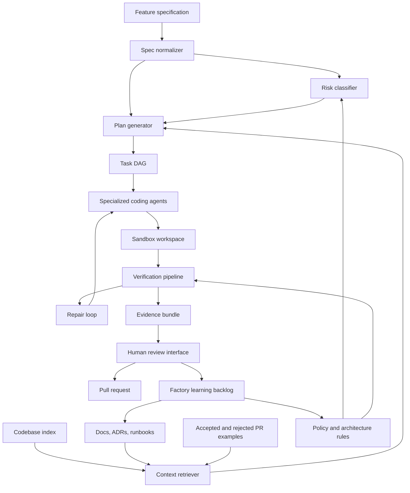

# AI Software Factory Research

Research date: 2026-06-08

This document synthesizes research on the "software factory" concept in the context of AI-assisted software creation for software teams. It uses the local case study at `/Users/215eight/Downloads/software-factory-case-study.pdf`, current public sources, and independent sub-agent memos covering lineage, the human layer, and the skeptical case.

## Executive Summary

An AI software factory is not just a code generator. It is a governed delivery system that turns structured product intent into reviewable, tested, policy-compliant software changes by combining:

- reusable software patterns and golden paths
- codebase intelligence
- deterministic workflow orchestration
- AI coding agents
- verification pipelines
- human authority, review, and accountability

The strongest working definition:

> An AI software factory is an internal platform that transforms bounded, well-specified feature requests into small, reviewable pull requests by using reusable patterns, indexed codebase context, agentic execution, automated verification, and explicit human approval gates.

The factory metaphor is useful only if treated carefully. Factories work when inputs, production steps, quality checks, and outputs are stable. Software teams often work in ambiguous, changing problem spaces. The value is therefore not "remove engineers from software creation." The value is to move humans toward higher-leverage work: specifying intent, setting architecture constraints, governing risk, reviewing evidence, and improving the production system.

## Why This Matters

The supplied Athena Digital case study is the clearest framing. Athena has high AI tool adoption, but measured delivery gains are modest:

- 94% of engineers use AI coding tools daily.
- Developers perceive 30-40% productivity gains for tasks like functions, debugging, and tests.
- Measured cycle time improved only 11%.
- The case study estimates code writing is 22% of engineering time; the other 78% is requirements, architecture, environment/config, review, integration, testing, QA, and deployment.

The implication is direct: AI coding assistants can accelerate the inner loop, but the organizational bottleneck is the outer loop. A software factory must attack the full delivery system, not only code generation.

## Historical Lineage

The software factory idea predates modern LLMs. The 2003 Greenfield and Short OOPSLA paper frames software factories as the convergence of component-based development, model-driven development, and software product lines. Its core claim is systematic reuse: capture knowledge about a product family as patterns, frameworks, models, and tools, then use those assets to reduce cost, time to market, and defects across related variants.

Earlier and adjacent traditions include:

- software product lines
- model-driven engineering
- component-based development
- domain-specific languages
- CASE tools
- application generators
- platform engineering
- internal developer platforms
- golden paths

The modern platform-engineering lineage matters because it solved part of the factory problem before AI: standardizing repeatable developer workflows through templates, self-service infrastructure, service catalogs, CI/CD, policy, and observability. Platform engineering sources define internal platforms as integrated self-service products that reduce developer cognitive load while preserving necessary context.

AI adds a new layer: agents can interpret intent, inspect existing code, infer conventions, produce patches, run tools, repair failures, and explain results. That shifts the factory from "template-driven scaffolding" toward "intent-to-change orchestration."

## What Is New Because Of AI

The new capability is not boilerplate generation. Templates and generators already did that.

The new capability is adaptive orchestration:

- inspect an existing codebase before generating
- retrieve local examples and conventions at generation time
- decompose a feature into ordered work items
- execute across files and languages
- run verification loops
- repair failures
- produce a pull request with evidence
- escalate decisions to humans at defined risk points

This makes AI software factories closer to "platform engineering plus agentic orchestration plus governance" than to "one big prompt."

## Core Architecture



The architecture should separate durable assets from replaceable AI tools. Durable assets are specifications, workflow state, codebase indexes, verification rules, policies, approvals, telemetry, and learning records. Models and coding agents should be adapters.

## Factory Layers

### 1. Specification Layer

The input must be more precise than a natural-language idea. A useful factory needs:

- product and repo target
- feature pattern, such as CRUD + UI, integration, workflow, or analytics
- entity schema and validation rules
- acceptance criteria
- non-goals
- data classification
- permissions and auth requirements
- migration safety requirements
- audit/logging requirements
- observability requirements
- rollout and feature flag requirements
- test expectations

The first factory task should often be spec normalization, not code generation. Ambiguous specs should create questions or blocked states.

### 2. Codebase Intelligence Layer

The factory must learn how each product actually works. Useful context includes:

- repo structure and ownership
- package/module boundaries
- API route patterns
- database migration examples
- model/entity conventions
- UI component conventions
- testing patterns and fixtures
- feature flag usage
- authorization patterns
- audit logging examples
- deployment and environment configuration
- incident and rollback history
- accepted PRs and review comments
- rejected PRs and why they failed

Retrieval must stay current. A stale index can automate obsolete architecture. Index updates should be triggered by merges, dependency updates, architecture decisions, incidents, and manual platform-team curation.

Cold start should be conservative: index the repo, infer conventions, ask for human validation of the inferred map, and start with low-risk generated changes before attempting full feature production.

### 3. Pattern And Golden Path Layer

The Athena case study identifies four recurring feature patterns:

- CRUD + UI
- external integration
- multi-step workflow
- analytics/reporting

These are good factory candidates because each has a predictable anatomy. For example, CRUD + UI commonly requires database changes, API endpoints, business logic, UI components, tests, feature flags, permissions, audit logging, documentation, and deployment configuration.

The factory should encode these as explicit production patterns, not hidden prompt lore. A pattern should define expected artifacts, allowed variation points, required checks, and human approval gates.

### 4. Orchestration Layer

Orchestration should be deterministic around workflow state and adaptive only inside bounded tasks.

Good orchestration properties:

- converts a spec into a task DAG
- records dependencies between tasks
- assigns tasks to agents or deterministic generators
- persists every stage and decision
- supports retry and resume
- classifies failures
- prevents risky actions without approval
- uses small batches
- creates traceable evidence

This is where many multi-agent systems fail. Free-form agent collaboration can become opaque. The factory needs a typed workflow where the orchestrator owns state and agents are replaceable executors.

### 5. Generation Layer

Generation can combine deterministic tools and AI agents:

- deterministic scaffolds for known file structures
- AST or framework-aware transforms where available
- AI agents for contextual code changes
- specialized agents for backend, frontend, tests, docs, migration, and review
- code review agents that run before human review

Use deterministic generation when the variation space is known. Use AI when local context and judgment are needed. Avoid using AI as a slower, less reliable replacement for a template.

### 6. Verification Layer

CI passing is necessary but insufficient. The factory should produce an evidence bundle with:

- lint and formatting results
- type checking
- unit tests
- integration tests
- contract tests
- migration dry-runs
- security scans
- dependency and license checks
- secret scans
- policy-as-code checks
- generated PR summary
- risks and unresolved assumptions
- files changed by stage
- human approval history

The target from the Athena case study is first-run CI pass at least 80% of the time and less than 30 minutes of human cleanup. Those are useful operational metrics, but correctness still depends on product and domain validation.

## Human Layer

The "human layer" is not a decorative approval step. It is the control system for authority, trust, and accountability.

### Human Responsibilities

Humans should own:

- product intent
- acceptance criteria
- architecture boundaries
- risk acceptance
- domain invariants
- security and compliance interpretation
- final merge and release decisions
- incident accountability
- factory improvement backlog

The role shift is from line-by-line authorship toward orchestration, review, and system stewardship.

### Role Changes

Product managers become spec owners. They must provide machine-actionable intent, examples, non-goals, and acceptance criteria.

Engineers become reviewers, system designers, and factory maintainers. Senior engineers approve architecture, validate plans, improve patterns, and debug factory failures.

Architects become policy authors. Architecture guidance should become machine-checkable where possible.

QA becomes evaluation design. Testers define behavioral checks, adversarial cases, holdout scenarios, and release evidence.

Security and compliance become embedded control designers. They define permissions, red lines, audit requirements, data boundaries, and approval thresholds.

### Review Model

A scalable review model should move review earlier and higher:

1. Review normalized spec.
2. Review generated plan and risk classification.
3. Approve risky stages before execution, such as migrations or auth changes.
4. Review diff plus evidence bundle.
5. Review production outcomes after release.
6. Feed defects and reviewer corrections back into factory patterns.

Line-by-line review should not disappear prematurely. The factory earns less review burden only after evidence shows low cleanup time, low escaped defects, strong traceability, and engineer trust.

### Trust Interface

Engineers will reject a black box. The review interface should show:

- what the factory understood
- what examples it retrieved
- what plan it generated
- what files each stage changed
- which tests and checks ran
- what failed and how it was repaired
- which assumptions remain
- which policies were evaluated
- what humans approved

Natural-language summaries are useful, but never sufficient. Reviewers need the underlying diff, logs, tests, and decisions.

## iamkelly.ai As Market Signal

The public site at [iamkelly.ai](https://iamkelly.ai/) is relevant because it packages an AI-native software creation promise:

- "Got an idea? Kelly's AI will build it."
- working product delivered in 7 days
- "AI-built, human-refined"
- customer owns code and IP

Its linked [BuildMyIdea](https://www.buildmyidea.com/) page describes an "AI swarm" that builds while humans review and refine. This is a clear example of the market moving from "AI coding assistant" to "AI-mediated software production service."

The caveat is important: the public site is marketing-level. It does not expose its workflow, quality bar, security model, compliance posture, test strategy, review protocol, or delivery evidence. Treat it as a signal of demand and positioning, not proof that enterprise-grade software factories are solved.

The strongest lesson from iamkelly.ai is the human layer phrase: "AI-built, human-refined." For enterprise teams, that must become "AI-generated, human-governed, evidence-verified, and human-accountable."

## Devil's Advocate

### The Factory Metaphor Can Mislead

Factories assume stable inputs and repeatable processes. Software often discovers requirements while building. A payment-method CRUD feature is not a stamped part if it touches Vault integration, audit logs, permissions, sensitive data, migrations, support workflows, and regulatory obligations.

### CI Passing Is Not Correctness

An agent can produce code that passes tests but violates business intent, architecture, security, privacy, UX, or operational constraints. Factory evidence must go beyond compile-and-test.

### Verification Tax Can Eat The Gains

DORA's 2026 analysis of AI tensions notes that time saved in creation is often reallocated to auditing and verification, and that higher AI adoption can increase both throughput and instability. A factory can generate faster than humans can review unless it also improves evidence, batch size, and review ergonomics.

### Human Trust Can Collapse Quickly

One plausible but unsafe auth change can erase weeks of adoption work. Trust is built by small, boring, correct outputs and transparent repair behavior.

### Stale Context Can Automate Bad Decisions

If the factory learns from legacy code without curation, it will reproduce legacy defects at scale. "Matches existing code" is not always the right goal.

### Economics Are Easy To Overstate

A 60-day prototype may be possible, but operating the factory is ongoing product work:

- prompt and agent maintenance
- repo indexing
- sandbox environments
- test data
- policy checks
- observability
- security reviews
- model/vendor changes
- user training
- incident response

### Junior Engineer Development Can Suffer

If junior engineers mostly approve code they did not write and do not understand, teams lose apprenticeship paths. The factory must include learning modes, paired review, and protected manual work on complex systems.

### Accountability Can Blur

When generated code causes an incident, the organization needs explicit ownership. The model vendor is not the production owner. The accountable parties should be defined before rollout.

## Security And Governance

AI-generated code and agent actions should be treated as untrusted until verified.

Relevant risk frames:

- [NIST AI RMF](https://www.nist.gov/itl/ai-risk-management-framework) for govern, map, measure, and manage practices
- [NIST SSDF SP 800-218](https://csrc.nist.gov/pubs/sp/800/218/final) for secure software development practices
- [OWASP LLM Top 10](https://owasp.org/www-project-top-10-for-large-language-model-applications/) for LLM application risks
- [OWASP Excessive Agency](https://genai.owasp.org/llmrisk/llm062025-excessive-agency/) for agent permission risks

Minimum controls:

- least-privilege agent permissions
- no production secrets in prompts or logs
- network and filesystem sandboxing
- allowlisted tools
- human approval before risky operations
- audit logs for all tool calls and generated decisions
- secret scanning
- dependency allowlists
- migration safety checks
- policy-as-code for auth, PII, logging, and infrastructure
- clear rollback and incident procedures

## Metrics

Avoid metrics that reward volume:

- lines generated
- prompts sent
- PR count
- agent utilization

Better metrics:

- cycle time from approved spec to merged PR
- first-run CI pass rate
- human cleanup time
- review latency and review burden
- escaped defects
- change failure rate
- rollback rate
- security findings
- policy violations caught before review
- production incidents caused by factory output
- reuse of approved patterns
- developer trust and cognitive load
- customer-facing outcome improvement

The most important metric is not "how much code did AI write?" It is "did the team ship safer, useful changes faster with less rework?"

## Practical V1 Scope

For a 60-day v1, the credible scope is narrow:

| Area | V1 | Defer |
| --- | --- | --- |
| Products | Two products | Full portfolio |
| Pattern | CRUD + UI | Integrations, workflows, analytics |
| Languages | Existing stack for selected products | All languages |
| Input | Structured feature spec | Free-form idea intake |
| Codebase intelligence | Repo map, examples, conventions, tests | Full semantic architecture model |
| Orchestration | Deterministic task DAG | Free-form multi-agent planning |
| Generation | Small PRs for known artifact types | Fully autonomous large features |
| Verification | Existing CI plus policy checks | Advanced formal/domain validation |
| Human gates | Spec, plan, risky stages, final PR | Reduced-review autonomy |
| Learning | Manual pattern updates from review feedback | Autonomous pattern mutation |

V1 should prove that the factory can produce boring, reviewable, low-risk changes with less cleanup than manual AI-assisted work.

## Worked Example: Payment Methods Management

Input:

```json
{
  "product": "payments-dashboard",
  "pattern": "crud_ui",
  "entity": "PaymentMethod",
  "fields": [
    {"name": "type", "kind": "enum", "values": ["credit_card", "ach", "wire"]},
    {"name": "label", "kind": "string"},
    {"name": "is_default", "kind": "boolean"},
    {"name": "vault_ref", "kind": "string", "sensitive": true}
  ],
  "permissions": "payment_methods:manage",
  "audit": true,
  "integrations": ["vault"],
  "ui": {"list": true, "detail": true, "form": true}
}
```

Factory flow:

1. Normalize spec.
   - Identify sensitive field.
   - Mark Vault integration as high-risk.
   - Require approval before migration and credential handling.

2. Retrieve context.
   - Existing CRUD examples.
   - Existing Vault client patterns.
   - Existing permission checks.
   - Existing audit log implementation.
   - Existing table/form components.
   - Migration examples and rollback conventions.

3. Generate plan.
   - Migration.
   - Domain model.
   - API routes.
   - permission gate.
   - audit logging.
   - Vault credential handling.
   - UI list/detail/form.
   - tests.
   - feature flag and config.

4. Human approves plan.
   - Tech lead validates architecture and risk.
   - Security validates credential handling.

5. Execute in stages.
   - Backend and migration first.
   - API contract generated and tested.
   - Frontend generated against contract.
   - Tests and config generated.

6. Verify.
   - Typecheck, tests, lint.
   - Migration dry-run.
   - secret scan.
   - policy checks for auth, audit, sensitive fields.

7. Produce PR.
   - Small diff.
   - Stage-by-stage summary.
   - Evidence bundle.
   - Assumptions and risks.
   - Human approval record.

8. Capture feedback.
   - Reviewer corrections update pattern backlog.
   - Repeated corrections become policy or generator changes.

## Implications For ai-sdd

This repository's requirements already align with a software-factory direction:

- OpenSpec as durable workflow source of truth
- typed workflow graph in `SDDCore`
- agent-agnostic execution adapters
- telemetry for usage, cost, verification, and review outcomes
- human approval and blocked states
- CLI and future MCP as sibling interfaces

The strongest product framing for `ai-sdd` is not "a prompt framework." It is a workflow control plane for agent-assisted software delivery. In software-factory terms:

- `SDDModels` should own canonical workflow contracts.
- `SDDCore` should own deterministic orchestration and state transitions.
- OpenSpec should store durable specs, plans, decisions, and run summaries.
- execution adapters should remain replaceable.
- telemetry should measure delivery outcomes and review burden, not only agent activity.

The durable asset should be the workflow and evidence model, not any one coding agent.

## Research Conclusion

The best concise framing:

> An AI software factory is a governed, evidence-producing internal developer platform that uses AI agents to automate repeatable delivery patterns while keeping humans in control of intent, architecture, risk, and release.

The concept is credible when scoped to repeatable patterns and existing codebases with strong conventions. It is weak when sold as autonomous software creation from vague ideas.

The path to credibility is:

1. Start narrow.
2. Encode patterns explicitly.
3. Keep workflow state deterministic.
4. Treat agent output as untrusted.
5. Build verification into every stage.
6. Make human authority visible and auditable.
7. Measure delivery outcomes, not generated output.
8. Use failures to improve the factory, not to blame individual reviewers.

## Sources

- Local PDF: `/Users/215eight/Downloads/software-factory-case-study.pdf`
- [Software Factories: Assembling Applications with Patterns, Models, Frameworks and Tools](https://www.s23m.com/oopsla2003/greenfield.pdf)
- [Platform Engineering overview, Google Cloud](https://cloud.google.com/solutions/platform-engineering)
- [CNCF Platforms White Paper](https://tag-app-delivery.cncf.io/whitepapers/platforms/)
- [Platform Engineering: What is platform engineering?](https://platformengineering.org/blog/what-is-platform-engineering)
- [Backstage Software Catalog](https://backstage.io/docs/features/software-catalog/)
- [Backstage Software Templates](https://backstage.io/docs/features/software-templates/)
- [Spotify Backstage golden paths and templates](https://backstage.spotify.com/learn/onboarding-software-to-backstage/setting-up-software-templates/11-spotify-templates/)
- [DORA 2025 State of AI-assisted Software Development](https://dora.dev/research/2025/dora-report/)
- [DORA: Balancing AI tensions](https://dora.dev/insights/balancing-ai-tensions/)
- [Thoughtworks Looking Glass 2026: AI and software delivery](https://www.thoughtworks.com/en-us/insights/looking-glass/looking-glass-2026/AI-and-software-delivery)
- [METR: Measuring the Impact of Early-2025 AI on Experienced Open-Source Developer Productivity](https://metr.org/Early_2025_AI_Experienced_OS_Devs_Study-paper.pdf)
- [NIST AI Risk Management Framework](https://www.nist.gov/itl/ai-risk-management-framework)
- [NIST Secure Software Development Framework SP 800-218](https://csrc.nist.gov/pubs/sp/800/218/final)
- [OWASP Top 10 for Large Language Model Applications](https://owasp.org/www-project-top-10-for-large-language-model-applications/)
- [OWASP LLM06:2025 Excessive Agency](https://genai.owasp.org/llmrisk/llm062025-excessive-agency/)
- [iamkelly.ai](https://iamkelly.ai/)
- [BuildMyIdea](https://www.buildmyidea.com/)
- [OpenAI Codex](https://openai.com/index/introducing-codex/)
- [GitHub Copilot cloud agent](https://docs.github.com/en/copilot/concepts/agents/cloud-agent/about-cloud-agent)
- [Anthropic Claude Code](https://www.anthropic.com/product/claude-code)
- [Google Jules](https://jules.google/)
- [HumanLayer](https://www.humanlayer.dev/)
