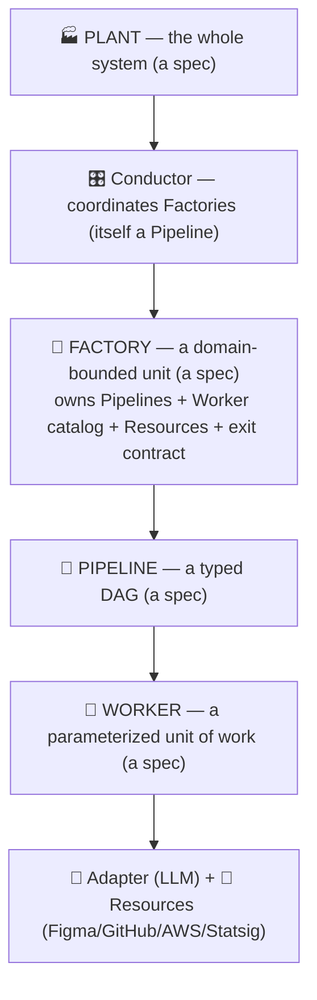
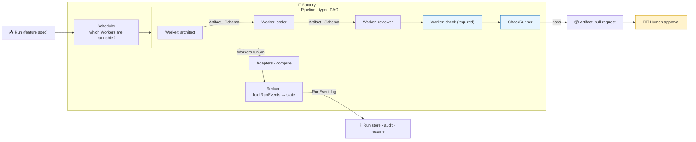
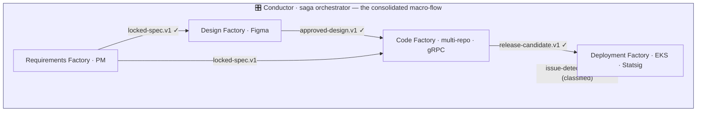

# Software Factory — Architecture

> **Status:** canonical foundation · **Last updated:** 2026-06-09
> This is the authoritative description of the system. Rationale and the history of
> choices live in [decisions.md](decisions.md). Background research is in
> [software-factory-research.md](software-factory-research.md).

---

## 1. What we are building

A system that turns a high-level feature specification into a complete, tested,
deployable change — across a multi-repo, multi-service codebase — that a human
reviews rather than rewrites. Not a code generator; a **production system**.

The premise (see the research doc): writing code is ~22% of software work, and AI
already accelerates that slice. The remaining ~78% — requirements, design,
architecture, integration, review, testing, rollout — is the bottleneck. This system
attacks that 78%, and treats **review and verification as first-class**, not afterthoughts.

## 2. The one principle

> **Specs are data. The engine is the only code.**

Every structural element — the Plant, its Factories, their Pipelines, the Workers,
the Checks — is a declarative, forkable, versioned **spec**. The engine is a fixed
interpreter that loads specs, resolves dependencies, runs work, evaluates checks, and
folds events into state. The engine knows nothing about "requirements" or "deployment";
it only knows how to interpret specs.

This is deliberate and validated. A hardcoded flow does not survive contact with real
teams — a lesson the community has already learned, with tools migrating from workflows
embedded in source code to externalized, declarative schemas. Changing the flow must
never require recompiling the engine.

**The first consequence — one binary, many roles.** The same engine binary runs an
*architect*, a *migrator*, a *reviewer*, or a *test author* by loading a different
**Worker** spec. None of these is a code path. An architect and a coder differ only by
their spec — typed signature, prompt template, checks, adapter, resources — and the
engine never branches on which one it is. So **adding a role is a config file, not a code
change**, and re-parameterizing a role per product (Go for payments, Python for
healthtech) is an overlay on the same spec, not a fork of the engine. The worked Worker
spec in [examples/sdlc-plant/workers/coder.api.worker.yaml](examples/sdlc-plant/workers/coder.api.worker.yaml)
is the entire definition of the `coder.api` role — there is no corresponding code.

## 3. The model is composable and self-similar

The system is four nested applications of the same idea. Same primitives at every
altitude: typed **Artifacts** flow along **Edges**; a **Check** guards each boundary; a
**Scheduler/Reducer** drives execution; a **RunEvent** log records it.



- **Worker** — a unit of work: runs on an **Adapter** (its brain) using **Resources** (its hands).
- **Pipeline** — a typed DAG of Workers.
- **Factory** — a domain-bounded unit that owns Pipelines + a Worker catalog + Resources + exit gates, and exposes a typed input/output **contract**. Independently owned, versioned, and deployable.
- **Conductor** — coordinates Factories. It is *itself just a Pipeline* whose nodes are Factories.
- **Plant** — the whole system: a spec declaring its Factories, the Conductor flow, and the inter-factory contracts.

**This is composability, not merely decomposition.** Each level is *built from* instances
of the level below — a Pipeline composes Workers, a Factory composes Pipelines, the
Conductor composes Factories — and the recursion closes because **the Conductor is itself
just a Pipeline whose nodes are Factories.** The same building block plugs in at every
altitude, so a sub-Pipeline, a Factory, and the whole Plant are the same kind of thing
viewed at different scales.

Because it is the same model composed recursively, decomposition costs **no new
primitives** — and any piece (a Worker, a Pipeline, a Factory) can be reused or recombined
into a different composition without change.

## 4. Canonical vocabulary

| Concept | Name | Notes |
|---|---|---|
| The whole system | **Plant** | spec: factories + conductor + contracts |
| A domain-bounded unit | **Factory** | owns pipelines, catalog, resources, exit contract |
| Cross-factory coordinator | **Conductor** | a saga orchestrator; itself a Pipeline |
| One pattern's typed DAG | **Pipeline** | nodes + edges, authored centrally |
| The role-performing unit | **Worker** | absorbs operator/role/node; named by its role |
| How the Scheduler treats a Worker | **WorkerKind** | `transform · check · human · map · sensor · pipeline · join` |
| A composable convention/capability module | **Trait** | conventions + checks + resources; may `require` other traits |
| A named bundle of Traits | **Stack** | the specialization a Worker resolves at run start (e.g. `ios-mac-app`) |
| The agent runtime a Worker runs on | **Adapter** | provider runtime that invokes repo skills (claude-code, codex); **resolved via the Model Catalog**, never named by the Worker |
| Provider/model resolution (per AI company) | **Model Catalog** | maps capability **tiers** → `(provider, model, reasoning)`; the one place concrete model ids live |
| External system integration | **Resource** | Figma, GitHub, AWS/EKS, Aurora, Statsig |
| Wire between Workers | **Edge** | carries an Artifact |
| Typed payload | **Artifact** | a typed **handle** (file/figma/git-ref/k8s/statsig/url) |
| An Artifact's type | **Schema** | type-checked at load |
| Assertion (blocking *or* scoring) | **Check** | unifies gate + eval; verdict from machine / AI / human — an open set |
| The single executor for checks | **CheckRunner** | `inline` mode blocks; `offline` mode scores |
| A check's output | **CheckResult** | status + metrics + evidence |
| One execution / the work item | **Run** | also the unit flowing through |
| Planner (which Workers are runnable) | **Scheduler** | reads the Pipeline's edges |
| Pure event→state fold | **Reducer** | replayable |
| Append-only event | **RunEvent** | audit + resume + eval replay |

**Not concepts (deliberately):** ~~Phase~~ (not a control concept — see §6), ~~Gate~~ (a required Check), ~~Socket/Port~~ (a Worker has a typed signature; the Edge carries the Artifact).

## 5. The flow lives in one place

The single most important structural rule, to keep the flow readable and not scattered:

- **Topology lives in the Pipeline.** The Pipeline spec lists nodes and edges. It is the *one* place you read to understand the flow, and it renders 1:1 to the DAG diagram.
- **A Worker declares only its typed signature** (`consumes`/`produces` Schemas) — *not* which other Workers it connects to. Like a function declaring its parameter types but not its callers.
- **Edges are authored, not inferred.** We do **not** auto-wire by matching types (that would scatter the flow). At load, each Edge is **type-checked** against the two Workers' signatures; a mis-wired edge fails to load.

This makes Workers reusable across Pipelines while keeping each flow a single consolidated artifact.

## 6. Control model: enablers vs. gates

Two concerns we keep strictly separate (the key refinement):

| Concern | Mechanism | Semantics |
|---|---|---|
| **What's possible now** | dependency **Edges** (the DAG) | **enablers** — readiness only; revisit/edit/re-run any node anytime |
| **What's actually required** | **Checks** (`required: true`) | **gates** — the explicit places the flow blocks: quality bars, approvals, compliance |

The DAG is a **readiness map, not a cage** — it never forces a rigid sequence. Gating is a separate, explicit, auditable concern carried by Checks. Consequence: **"phase" is not a control concept.** Control flow = dependency-readiness (enablers) + Checks (gates). Phase survives, if at all, only as a cosmetic UI label.

### Scheduling & state



- A Worker is **runnable** when every required input Edge is satisfied by a `ready` Artifact of the right Schema.
- The Scheduler computes readiness **over the Pipeline's central edge list** — it never polls Workers or auto-discovers connections.
- State is **event-sourced**: the `RunEvent` log is the source of truth; the run summary is a projection. This gives audit (SOC2/HIPAA), resume, and eval replay from one log. The log is **bidirectional** — external systems (a Statsig webhook, an alert) can ingest events into it (see §10, sensors).

### State plane vs compute plane

A multi-user flow — a designer on machine A hands off to a coder on machine B — only works if
the source of truth is **shared**. So the model separates two planes:

- **State plane (shared, canonical).** The `RunEvent` log *and* the artifact store live in a
  shared, durable store every participant, machine, webhook, and CI runner can reach. When
  designer A approves the handoff, the event and the `approved-design.v1` artifact are written
  **here** — never only to A's laptop.
- **Compute plane (transient, distributed).** The engine that folds events and runs Workers is
  a *client* of the state plane. It can run anywhere (A's machine, B's machine, CI, cron, a
  server) and may be one-shot. Whoever is triggered reads the shared log, advances, and writes
  back.

So "resume needs no always-on process" (§10) is about the **compute**, not the state: the
compute is transient, but the **state must be shared.** A purely local log is valid only for a
single-user loop; any cross-user/cross-machine handoff requires the shared state plane. The
store must give a **total order per Run** (an event store, or a Git branch); `ai-sdd`'s
one-active-run lock + the pure Reducer + `IdentityAttribution` (who wrote each event) fit that.
The backend is **Git-as-control-plane** (ADR-0025) — the Run state pushed to a shared repo with
optimistic-concurrency appends (one file per event, ULID-ordered, idempotent) — chosen as the
starting solution and swappable for a control-plane service behind the `StateStore` abstraction
with no flow-spec change.

## 7. Workers, Artifacts, Schemas

A **Worker** is fully determined by its spec, and it is **framework-agnostic**. Its unit
of work is a **skill** — or a command that runs a skill — defined in the repo and surfaced
to the agent via `AGENTS.md` / `CLAUDE.md`, *not* a bespoke inline prompt. It declares a
model **tier** (a capability alias such as `deep-reasoning`) and a **reasoning level**
(`minimal/low/medium/high`) — **never a provider or a concrete model id.** It also lists
its typed `consumes`/`produces`, its `resources` (hands), a `context` retrieval policy
(codebase intelligence), the `checks` its output must pass, and a `retry` policy. The same
engine runs any Worker by loading a different spec — that is what "the factory takes
multiple roles by configuring parameters" means.

A **Model Catalog** — one per AI company, selected by the workspace `config` — resolves a
tier to a concrete `(provider, model, reasoning)`, and the **Adapter** (the provider's
agent runtime, e.g. claude-code or codex) is resolved *from* the catalog, not named by the
Worker. **Workers always go through the catalog; none pins a provider or model.** Two
consequences: (1) retargeting the entire Plant to a different AI company is a **catalog
swap** with zero Worker edits; (2) model churn — a new top model shipping — is a **one-line
catalog edit** that, being a versioned spec change, trips the promotion gate (§8), so the
new model goes live only if its eval suite does not regress.

### Guardrails

A Worker's authority is least-privilege and **runtime-enforced** — the engine translates
the spec into the Adapter's sandbox (Claude Code permissions / MCP scopes / filesystem
sandbox), so guardrails bind the agent rather than merely being prompted, and every tool
use is attributed (`IdentityAttribution`) for audit. Two kinds:

- **Capability guardrails** — a `permissions` block: an access mode per Resource
  (`read-only` vs `read-write`), a tool **allow/deny** list, and a **filesystem scope**.
  Default-deny — a Worker can touch nothing it was not granted. A `reviewer` is `read-only`
  and cannot edit or push; an `implementer` is `read-write` scoped to specific paths.
- **Convention guardrails** — the enabler/gate split from §6: conventions are *injected*
  via `context` (soft guidance) **and** *enforced* via `checks` (hard backpressure).

A **Resource** (the Worker's hands) is its own spec and resolves to either an **MCP server**
or **CLI tools** with a specific configuration; credentials come from the `SecretResolving`
boundary, and it carries a default access mode and scope.

**Scope confinement (no cross-cutting).** A Worker instance's write scope is bound to its
assigned repo/stack, derived from the run's `StackAssignment`. One instance = one repo's
scope; it **cannot** edit another service by construction. Cross-service change is never one
Worker reaching across repos — it is decomposed at the Pipeline level via `map` (one
instance per service) coordinated through a **shared typed Artifact** (e.g. the gRPC
contract). Architectural cross-cutting — logic placed in the wrong layer, the one thing
write-scope can't catch — is a `judge` Check.

### Stacks are compositions of Traits

A stack is not a scalar. A **Trait** is a composable convention/capability module (`apple`,
`ios`, `macos`, `combine`, `swiftui`, a specific UI package) that contributes conventions,
checks, and optionally resources, and may `require` other traits. A **Stack** is a named
bundle of Traits — so a multi-platform app is `stack: ios-mac-app` =
`[ios, macos, combine, acme-ui]`, with `apple`/`swiftui` pulled in transitively. One
`reviewer`/`coder` role serves every stack; the Stack supplies the specialization. (This is
the §3 composability principle applied to conventions.)

Resolution is **late-bound** at run start (not a pre-generation step): the engine expands
the Stack's transitive `requires`, unions the conventions (injected in order), unions and
**de-dupes** the checks, and unions the resources. The fully-resolved binding — which
traits, which convention/check versions, the resolved model tier — is **snapshotted into
the `RunEvent` log**, giving static-config inspectability and reproducible replay without
materializing per-stack specs.

An **Artifact** is a typed **handle**, not necessarily a repo file: `file`, `figma`
(a node id), `git-ref`, `k8s`, `statsig`, or `url`. It is content-addressed, carries
its producing identity (audit), and has a state (`missing/empty/placeholder/ready`).
Its **Schema** is registered and used to type-check edges at load and validate output at
produce-time.

## 8. Checks — gates and evals are the same thing

A **Check** is one assertion run by one **CheckRunner** in one of two modes:

- **inline** (on a live Run) — **blocks**; a failing required Check triggers rework.
- **offline** (on fixtures) — **scores**; this is what we call an *eval*.

Same definition, same executor, same `CheckResult`. So a verification gate written once
*is* a regression eval — no drift between "what we measure" and "what gates the line."

- Checks are **namespaced** (`typecheck.go`, `judge.api-conventions`, `gate.hipaa-phi`) and resolved from a registry; a Worker references them by id.
- Offline Check suites are harvested from successful Runs (their inputs become fixtures, their accepted outputs become goldens). Bumping a Worker/Check version triggers a **promotion gate**: it cannot ship if its suite regresses. Judge checks have their own "judge-the-judge" suite against human labels.

### Verification is plural and open by design

The purpose of the Check abstraction is **not** to prescribe one verification mechanism — it
is to let **many kinds of verification coexist** behind a single interface (`CheckResult`), so
new verification models can be added without changing the engine. A verdict can come from any
of three sources today, and the set is intentionally open-ended:

- **Machine** (`checkKind: deterministic`) — run a command, parse metrics, compare thresholds:
  build / typecheck / lint / tests, structural & completeness validation, coverage and mutation,
  property-based checks, security and compliance scans, visual/snapshot diffs. Compliance is
  **always** this kind — an auditable command, never an opinion.
- **AI** (`checkKind: judge`) — an LLM rubric: convention conformance, architectural placement,
  review-against-spec, UI fidelity. Each judge Check is itself eval-gated ("judge-the-judge").
- **Human** (`workerKind: human`) — an approval gate; a person is the verdict.

These three are the *current* kinds, not a closed list. Because the engine treats every
verification identically — an assertion that produces a `CheckResult` — **adding a new
verification model is adding a Check spec, not changing code.** (The point is the plurality,
not any one mechanism we ship with.)

### Verification is composed per slice

The verification that applies to a slice is **assembled at run start** from several selectors,
not fixed in one place:

```
effective checks  =  Worker.checks
                  ∪  resolved Trait.checks       (per stack — §7)
                  ∪  acceptance-surface checks    (ui / api / cli / operator)
                  ∪  risk-tier checks             (low / medium / high depth)
```

So a slice's verification scales with *what it is* (its stack), *how it's accepted* (its
acceptance surface), and *how risky it is* (its tier). The composed set is snapshotted into the
`RunEvent` log, then run inline. Acceptance surface and risk tier are first-class **Check
selectors**, not labels.

### Bootstrapping a stack, and keeping it fresh

A stack's conventions (a Trait) and much of its verification (Checks) are **bootstrapped** from
a real codebase by an onboarding step — *not* authored per run. The output splits into two very
different freshness profiles:

- **Executable verification** — Checks wired to the repo's *live* tooling (lint, types, tests,
  CI). They re-evaluate the current code every run, so they **cannot go stale** by construction.
  Prefer these: most verification should be executable, not prose.
- **Prose conventions** — the house-style guidance a linter can't encode (layering, naming,
  patterns), injected as context and backed by judge Checks. This **can** drift from an evolving
  codebase, so it is *managed*: versioned, flagged by a drift-detection meta-check, and refreshed
  by re-bootstrap (eval-gated by the promotion gate above). The executable Checks are the
  backstop, so stale prose degrades guidance but never ships bad code.

This is why bootstrapping conventions is **not** the same mistake as pre-generating worker specs
(rejected in favor of late resolution, §7): conventions are *extracted from the codebase* —
there is no spec to resolve them from — whereas a per-stack worker config is *derived from other
specs* and should just be resolved live.

## 9. Iteration & rework (the DAG is acyclic; execution is not)

Rework ("review fails → back to the implementer") is **not** a topology cycle and does
**not** require leaving the DAG:

- The DAG describes **dependencies** (static, acyclic). Re-running a Worker is a new *attempt*, not a new dependency.
- Review feedback is an **optional, delayed input** — like feedback-with-unit-delay in a control loop. Attempt 1 runs without it; attempt N reads attempt N-1's notes. Unrolled, it is still a DAG.
- General rule: **a failing Check routes back to the Worker(s) that produced its inputs**, as a *bounded* re-execution with the `CheckResult` as added context, until it passes or the budget is spent (then → human). Review is just the human/judge-grade Check in this one mechanism.
- Iteration reintroduces the halting concern, so termination is **explicit**: bounded rounds + escalation; **scoped invalidation** (re-run only the affected Worker and its downstream dependents, build-system style); state carried across attempts (diff-aware). Every round is a `RunEvent` (auditable).

## 10. Scaling primitives

Four standard orchestration extensions, each living where its domain needs it:

| Primitive | What it solves | Lives in | Prior art |
|---|---|---|---|
| **map** (`map_over: <collection>`) | dynamic fan-out over runtime-discovered sets (per service/repo, per milestone, per acceptance criterion) | inside Factories | Argo `withParam`, Airflow `.expand()`, Dagster `DynamicOut` |
| **sub-pipeline / factory** (`workerKind: pipeline`) | hierarchy / nesting | everywhere | Argo templates, Temporal child workflows |
| **sensor** (`workerKind: sensor`) | wait on external signal + time (alerts, Statsig results, elapsed time) | inside the Deployment Factory | Airflow/Dagster sensors, Temporal signals/timers |
| **resource** | external system integration (Figma, GitHub, AWS/EKS, Aurora, Statsig) | scoped per Factory | Dagster resources, Terraform providers |

`map` keeps the flow consolidated: you author **one** map node (visible in the Pipeline
spec); the Scheduler **materializes** N instances at runtime. The authored template stays
readable; only the materialized execution graph expands.

### Asynchronous, durable resumption

The old `ai-sdd` was synchronous and single-machine. The new model resumes a flow on an
**external event that arrives later** — an MR approval, a CI/CD completion, a webhook — and it
does so **without keeping a process alive.** Three pieces, all already in the model:

1. **Durable runs.** A Run is event-sourced (§6): its state lives in the persisted `RunEvent`
   log, reconstructable by the Reducer. A Run can therefore be *parked with no process
   running* — its state is on disk, not in memory.
2. **Suspend at a waiting node.** When the Scheduler reaches a `sensor` (CI done, MR approved)
   or a `human` node, it does not block a thread: it records a **subscription** (event type +
   a **correlation key** — the MR number, the CI run id, the branch+commit), emits a `waiting`
   event (status → `input-required` / `approval-required`), persists, and the process can
   **exit.** This is exactly how `ai-sdd`'s `runLoop` already parks on `approvalRequired` and
   resumes on an `approveGate` call — generalized from one human CLI call to any external event.
3. **Ingest + resume.** When the event occurs it is appended to the log via the bidirectional
   ingest boundary (§6), matched to the parked Run and node by the correlation key. The Reducer
   folds it, the waiting node is satisfied, and the Scheduler continues **from the suspension
   point** (not a restart). Ingest is **idempotent** (dedup by event id), so a repeated delivery
   does not double-resume.

The *compute* can be transient even **on a local machine** — there is no always-on server — but
the **state still lives in the shared state plane (§6), not on the laptop** (otherwise a handoff
to another person or machine would be invisible to them). Given that shared store, the resume
trigger is whatever is convenient — the engine is simply **re-invoked** to fold pending events
and advance:

- a **CLI hook** the external step calls on completion (CI's last step runs
  `factory ingest --run <id> --event ci-completed`; a git post-merge hook does the same);
- a **poll** (`factory resume`, optionally on cron) that checks external status and ingests any
  change — best when there is no public webhook URL;
- a lightweight **local watcher/daemon** (poll, or a webhook via a tunnel).

Because the shared state is durable and resume is just *fold-event-then-schedule*, the compute
never needs to run continuously — a one-shot process suffices, while the shared store carries the
state across people and machines. (This is the general mechanism behind ADR-0016's durable,
resumable rollout.)

## 11. The Plant & the Conductor

A **Plant** spec decomposes the system into domain-bounded **Factories** (aligned to
phases *and* team ownership — Conway's law). Repo/service-level fan-out stays *inside* a
Factory (via `map`); we do **not** make every repo a Factory (that is the
distributed-monolith trap).



- **Coordination = orchestration for the forward backbone + events for exceptions.** The Conductor (a saga orchestrator) explicitly drives the forward path, so the macro-flow is one readable definition. The rare, asynchronous long-range feedback (Deployment detects an issue → re-enter Requirements/Design/Code) flows as a **classified signal** the Conductor catches — *not* through the synchronous backbone. We avoid pure choreography precisely because it would scatter the flow.
- The `✓` on each Edge is a **boundary Check** = the APPROVAL gate / the inter-factory contract.
- A single **correlation Run id** threads through all Factories for end-to-end tracing.

## 12. The spec hierarchy & the engine boundary

```
plant.yaml                       # which Factories · the Conductor flow · inter-factory contracts
config.yaml                      # layered context injection (stack, conventions, compliance)
factories/<name>.factory.yaml    # pipelines/workers it owns · its exit contract
pipelines/<name>.pipeline.yaml   # a typed DAG (nodes + edges)
workers/<name>.worker.yaml       # signature + adapter + resources + checks + template
checks/<name>.check.yaml         # a gate/eval definition
templates/<name>.md              # instruction templates per Worker

—— the ONLY compiled code ——
engine/                          # spec loader + validator · Scheduler · Reducer · CheckRunner · Conductor runtime
```

Every spec is **forkable** (`fork`/`init`/`validate`) and **versioned**. Context is
injected in layers (Plant → Factory → Pipeline) and prepended to Worker instructions.
A working set of these specs for the example SDLC lives in
[examples/sdlc-plant/](examples/sdlc-plant/).

## 13. Mapping to the example SDLC

The PM → Design → Engineering → Ops lifecycle maps to a four-Factory Plant; the **HANDOFFs
are the Factory boundaries** and the **APPROVALs are the contracts**:

| SDLC phase | Factory | Owner | Exit contract |
|---|---|---|---|
| Requirements → spec locked | Requirements | PM | `locked-spec.v1` |
| UI/UX flows → design sign-off | Design | Designer + Figma | `approved-design.v1` |
| RFC → milestones → per-task TDD → pre-rollout gates | Code | Engineering (multi-repo, gRPC) | `release-candidate.v1` |
| Phased rollout → observe → full rollout | Deployment | Ops (EKS, Aurora, Statsig) | `rollout-outcome.v1` |

The per-task TDD subprocess and its peer-review loop map directly to a sub-Pipeline with
the bounded rework loop of §9. The 7-criteria pre-rollout gate is the composite boundary
Check on `release-candidate.v1`.

**Pluggable intake** is a *set* of varied sources synthesized into one canonical artifact —
**not** a single document — and it varies on two *orthogonal* axes that compose instead of
multiplying:

- **Transport / format** — *where each source lives and how to read it* (Google Docs, a repo
  file, a PDF). The intake arrives as an **`intake-bundle.v1`** (a list of source handles); a
  **`map`** (§10) over the bundle routes each source to its per-transport **loader** Worker,
  which uses the matching **Resource** (e.g. a Google-Docs MCP, the filesystem, a PDF
  extractor; credentials via `SecretResolving`) to extract raw text into an `intake-source.v1`
  envelope. Extraction is preferably deterministic (export / `pdftotext` / read); vision only
  for scanned input.
- **Semantic type** — *what each source means* (`intakeType`: idea / PRD / hiring-challenge),
  declared at run start or inferred from the text.

The `intake.normalizer` then runs as a **join**: it consumes the *whole set* of
`intake-source.v1` and **synthesizes** them — reconciling, de-duplicating, and
cross-referencing across documents — into the **one** canonical `normalized-intake.v1`.

Every downstream Worker depends only on that Schema (§5), so both axes are **add-only** — a
new transport = one loader + one Resource; a new semantic type = one normalization skill — and
they never multiply (3 transports + 3 types = 3 loaders + 3 skills, not 9), while the number of
*sources* per intake is unbounded (the load step is a `map`). This generalizes `ai-sdd`'s
`IntakeType` enum to an open set; it is the compiler's *many front-ends → one IR → one
back-end* shape, with a synthesis join, applied to the input boundary.

## 14. Relationship to the existing `ai-sdd` code

The original `ai-sdd` — the hardcoded plan→implement→review phase engine — is **not** the base
for the new model. It lives under `legacy/` as reference (a parts bin); the new spec-driven
engine is greenfield (`Sources/FactoryModels`, `Sources/FactoryEngine`). The phase engine is
*replaced*; only the **infra patterns** are worth porting deliberately:

| Concern | From `legacy/` | New |
|---|---|---|
| Deterministic engine | `WorkflowEngine.evaluate` (phase machine) | **replaced** by `Scheduler` + `Reducer` over a typed DAG |
| Run state | `RunSummary` persistence | `RunEvent` log (shared state plane, ADR-0025); `RunSummary` is a projection |
| Workers | `agentRole` strings | `Worker` spec loader + catalog |
| Dependencies | `dependencyGraph` (unenforced) | the Scheduler input; typed Edges, type-checked at load |
| Artifacts | `ArtifactRef`, `ArtifactState` | `Schema` registry + handle types |
| Approvals | `approveGate` / `rejectGate` | `workerKind: human` + required Checks |
| Identity / audit | `IdentityAttribution`, telemetry, `TokenAttribution` | port; attach to every `RunEvent` |
| Secrets | `SecretResolving` | port; wire into `Resource` credentials |
| Execution | `AgentAdapter` | `Adapter` (LLM) + `Resource` (systems), resolved via the Model Catalog |

**Status — first engine slice built.** `FactoryModels` (Codable spec types: `SpecEnvelope`,
`PipelineSpec`, `WorkerSpec`, `PortSpec`, `OneOrMany`) + `FactoryEngine` (`SpecLoader`,
`SpecValidator`, `Scheduler`, `Reducer`) compile and are tested: a pipeline + workers load, the
edge type-check catches a mis-wired edge, and the Scheduler/Reducer resolve the DAG (parallel
branches included). Specs decode from JSON for now; YAML via Yams plugs into the same Codable
types later (ADR-0020). Not yet built: the full `RunEvent` set, the CheckRunner,
Resources/Adapters, `map`/sensors, the shared state-plane store, and the Conductor.

## 15. Open questions

Tracked in [decisions.md](decisions.md) under "Open." Notable: durable/resumable rollout
sub-pipeline mechanics; inter-factory contract versioning & back-compat; cross-repo
atomicity for gRPC-contract changes; naming of the Conductor.

## References

- **OpenSpec / OPSX** — a spec-driven workflow system that migrated from a hardcoded
  workflow embedded in source to externalized, declarative YAML schemas. Independent
  community precedent for the spec-vs-engine principle (§2) and the enablers-vs-gates
  control model (§6).
  - Repository: <https://github.com/Fission-AI/OpenSpec/>
  - OPSX design doc: <https://github.com/Fission-AI/OpenSpec/blob/main/docs/opsx.md>
