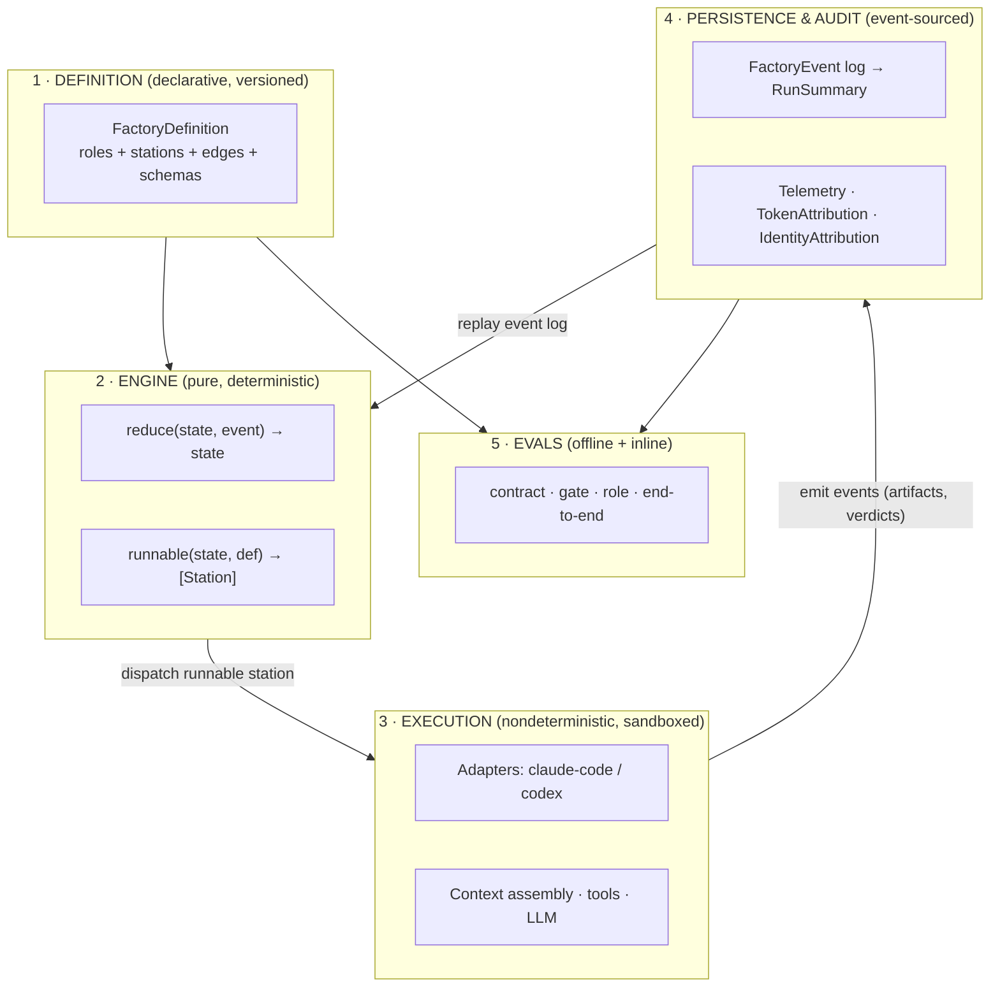
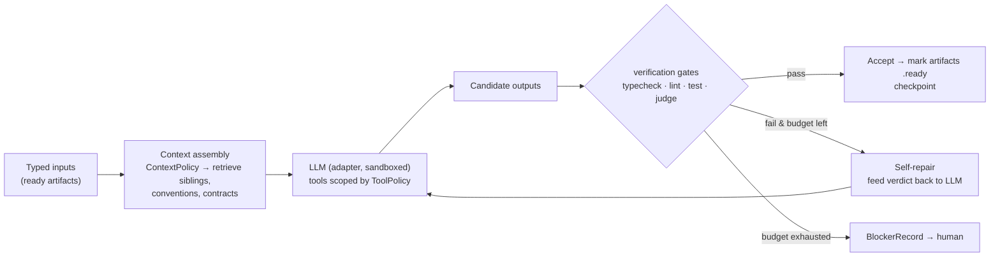
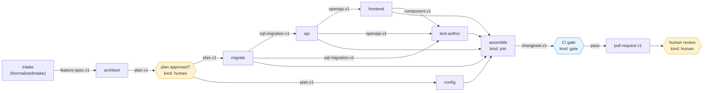
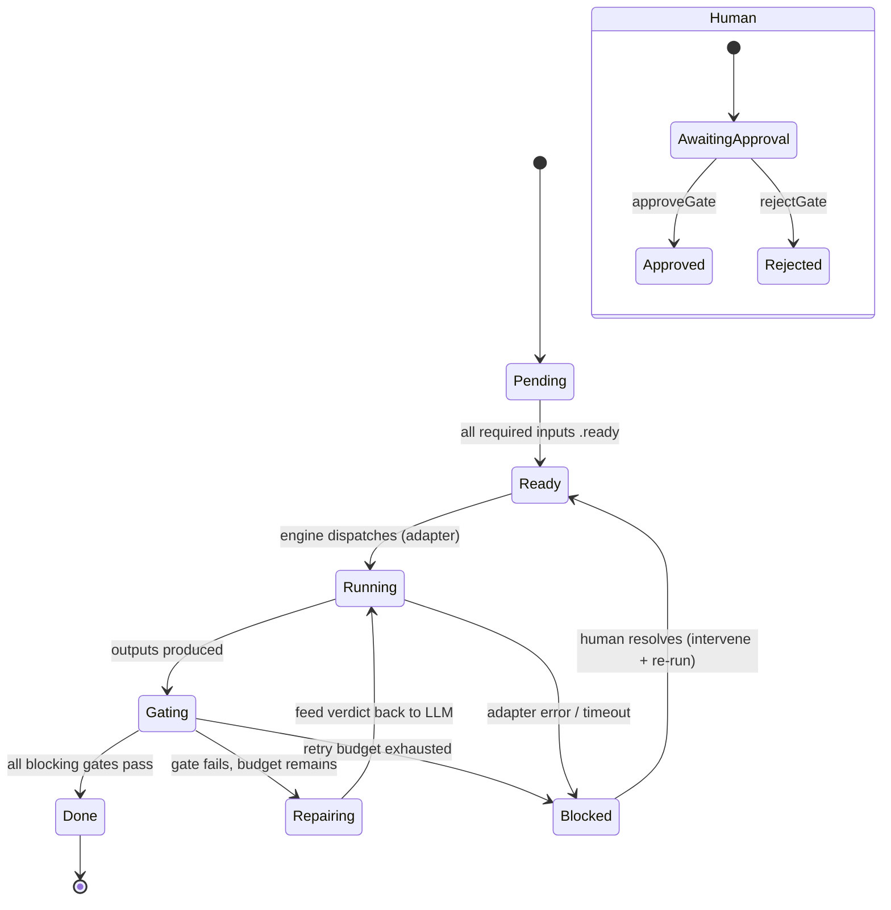
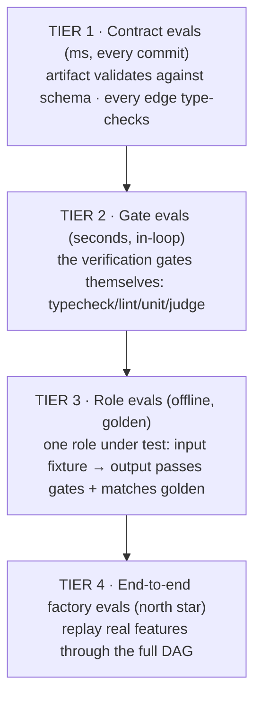

# Designing a Stripe-Style Software Factory (for `ai-sdd`)

> How to evolve the current `plan → implement → review` engine into a **configurable
> factory** where every role is data, the topology is a typed DAG, and quality is
> enforced by in-loop gates + an eval harness.
>
> Companion to [software-factory-research.md](software-factory-research.md). Types are
> written in Swift to match the existing `SDDModels` / `SDDCore` packages and reuse
> their names (`ArtifactRef`, `ArtifactState`, `RunSummary`, `IdentityAttribution`,
> `CompletionContract`, `AgentAdapter`, `ApprovalRecord`, `BlockerRecord`, …).

---

## 0. The one principle

> **Role = data. Engine = fixed.**
> The engine is a small deterministic interpreter of a typed DAG. *Roles, gates, edges,
> and contracts are declarative config.* The LLM only ever runs **inside a station**,
> sandboxed, behind a gate. This is the Stripe pattern: a creative agentic core wrapped
> in deterministic guardrails.

Everything below is a consequence of that sentence. The same binary runs an "architect,"
a "migrator," a "reviewer," or a "test author" by loading a different `RoleDefinition`.
Adding a role is a config file, not a code change.

Where you are today vs. where this goes:

| Today (`ai-sdd`) | This design |
|---|---|
| Fixed `WorkflowPhase` enum: plan/implement/review | Phase becomes a *tag*; control flow is a typed DAG of stations |
| Role hardcoded in `WorkflowEngine` (`agentRole: "sdd-planner"`) | Role is a loaded `RoleDefinition`; engine is role-agnostic |
| `dependencyGraph: [DependencyEdge]` exists but isn't enforced | DAG readiness *is* the scheduler |
| `ArtifactRef { type, path }` — untyped blob | `ArtifactEnvelope` carries a `schemaId`; edges are type-checked |
| Approval gates exist (`approveGate`/`rejectGate`) | Generalized to any station with `kind: .human` |
| No eval harness for output quality | 4-tier eval harness (contract → gate → role → end-to-end) |

---

## 1. Overall architecture: five layers



- **Definition** is the only thing that changes per role/product. Content-addressed and versioned so a run pins the exact factory + role versions it used (reproducibility, eval attribution).
- **Engine** is a pure reducer (this *is* `WorkflowEngine`, generalized). Pure → trivially testable, replayable, and the substrate for evals.
- **Execution** is your existing `AgentAdapter` + `ExecutionAdapterInvocation`. It is the *only* nondeterministic part, and it is always sandboxed and gated.
- **Persistence** becomes event-sourced: `RunSummary` is a *projection* of an append-only `FactoryEvent` log. You already persist `RunSummary` to `openspec/changes/<slug>/run-summary.json`; add the event log beside it. This gives you free resume, audit (SOC2/HIPAA), and eval replay.
- **Evals** consume the same artifacts/events the engine produces.

---

## 2. The core abstraction: a Station is a parameterized Role

A **`RoleDefinition`** fully determines a station's behavior. The engine reads it; it never branches on "is this the planner?". This is the heart of "multiple roles by configuring parameters."

```swift
public struct RoleDefinition: Codable, Equatable {
    public var id: String              // "architect", "coder.api", "migrator", "reviewer"
    public var version: String         // pinned per run for reproducibility
    public var kind: StationKind       // how the ENGINE treats this node
    public var phaseTag: WorkflowPhase // keep existing enum as a *label* for UI/telemetry

    // Typed boundary — the contract this role honors
    public var inputs: [PortSpec]
    public var outputs: [PortSpec]

    // How the role thinks (all data, no code)
    public var prompt: PromptRef           // template id + variable bindings
    public var context: ContextPolicy      // codebase-intelligence retrieval spec
    public var tools: ToolPolicy           // allowed tools + filesystem scope + secret refs
    public var binding: AdapterBinding      // adapter + model, or .any

    // Guardrails
    public var verification: [String]      // GateDefinition.ids run on outputs before accept
    public var retry: RetryPolicy          // self-repair budget
    public var completion: CompletionContract  // REUSE: submitPhase + requiresHumanApproval
    public var budget: Budget              // token / time ceiling
}

public enum StationKind: String, Codable, CaseIterable {
    case transform   // LLM produces artifacts (architect, coder, test-author, reviewer)
    case gate        // deterministic check, NO LLM (typecheck, unit, lint, schema)
    case human       // approval / input  (generalizes approveGate/rejectGate)
    case fanout      // split one input into N parallel children (per-table, per-endpoint)
    case join        // merge children back (assemble PR)
}
```

The catalog roles (architect, migrator, API coder, frontend coder, test author, reviewer,
integrator) are **all `RoleDefinition` instances of `kind: .transform`** that differ only in
their `inputs`/`outputs` schemas, `prompt`, `context`, and `verification`. Two examples,
same engine, same `coder.api` role id, re-parameterized per product:

```yaml
# roles/coder.api.payments.yaml
id: coder.api
version: 3
kind: transform
phaseTag: implement
binding: { adapter: claude-code, model: claude-opus-4-8 }
inputs:
  - { name: contract, schemaId: openapi.v1, required: true }
  - { name: migration, schemaId: sql-migration.v1, required: true }
outputs:
  - { name: handlers, schemaId: go-source.v1, cardinality: many }
context:
  retrieve: [ "siblings:api/**/*.go", "conventions:.sdd/conventions/go.md" ]
verification: [ typecheck.go, lint.go, unit.go, judge.api-conventions ]
prompt: { template: coder.api, vars: { language: go } }

# roles/coder.api.healthtech.yaml  → SAME role, different params
id: coder.api
version: 3
binding: { adapter: claude-code, model: claude-opus-4-8 }
outputs:
  - { name: handlers, schemaId: py-source.v1, cardinality: many }
context:
  retrieve: [ "siblings:app/api/**/*.py", "conventions:.sdd/conventions/python.md" ]
verification: [ typecheck.py, lint.py, unit.py, judge.api-conventions, gate.hipaa-phi ]
prompt: { template: coder.api, vars: { language: python } }
```

Nothing in `SDDCore` changes between these. That is the test of a real factory.

### Station anatomy (what happens when the engine dispatches one)



The station is a closed loop: an LLM step is *never* trusted until its own gates pass. Self-repair happens **inside** the station, before any human is asked.

---

## 3. Data structures (typed, reusing your models)

### 3.1 Schemas & typed artifacts

The missing primitive today is *type*. `ArtifactRef { type, path }` is a blob; add a schema registry so edges can be checked.

```swift
public struct ArtifactSchema: Codable, Equatable {
    public var id: String        // "openapi.v1", "sql-migration.v1", "task-list.v1", "go-source.v1"
    public var version: String
    public var mediaType: String // "application/json", "application/sql", "text/x.go"
    public var jsonSchema: Data? // optional JSON Schema for *structured* artifacts (plans, specs)
}

// Runtime envelope around an artifact (wraps existing ArtifactRef + ArtifactState)
public struct ArtifactEnvelope: Codable, Equatable {
    public var ref: ArtifactRef              // REUSE { type, path }
    public var schemaId: String
    public var state: ArtifactState          // REUSE: missing/empty/placeholder/ready
    public var producedBy: String            // station id
    public var contentHash: String           // content-addressed → caching + eval keys
    public var identity: IdentityAttribution // REUSE: who/what produced it (audit)
}
```

### 3.2 Ports, stations, edges, factory

```swift
public struct PortSpec: Codable, Equatable {
    public var name: String          // "contract", "migration", "handlers"
    public var schemaId: String      // must exist in FactoryDefinition.schemas
    public var cardinality: Cardinality
    public var required: Bool
}
public enum Cardinality: String, Codable { case one, many }

public struct Station: Codable, Equatable {
    public var id: String                  // node id in THIS graph: "api", "ui", "migrate"
    public var role: String                // RoleDefinition.id
    public var roleVersion: String
    public var params: [String: String]    // per-station overrides (table name, product slug)
}

public struct PortAddress: Codable, Equatable {
    public var stationId: String
    public var port: String
}
public struct Edge: Codable, Equatable {
    public var from: PortAddress   // producer station + output port
    public var to: PortAddress     // consumer station + input port
}

public struct FactoryDefinition: Codable, Equatable {
    public var id: String          // "crud-ui.v1"
    public var version: String
    public var schemas: [ArtifactSchema]
    public var roles: [RoleDefinition]
    public var stations: [Station]
    public var edges: [Edge]
}
```

### 3.3 Gates & verdicts

```swift
public struct GateDefinition: Codable, Equatable {
    public var id: String          // "unit.go", "typecheck.py", "judge.api-conventions"
    public var kind: GateKind
    public var command: String?    // deterministic: CI selector / shell (selective tests)
    public var rubric: PromptRef?  // judge: rubric template
    public var thresholds: [String: Double]  // e.g. ["tests.failed": 0, "judge.score": 0.8]
    public var blocking: Bool      // false = advisory (surfaced, doesn't stop the line)
}
public enum GateKind: String, Codable { case deterministic, judge }

public struct Verdict: Codable, Equatable {
    public var gate: String
    public var status: GateStatus            // pass / fail / error
    public var metrics: [String: Double]     // "tests.failed": 0, "coverage": 0.86
    public var evidenceRef: ArtifactRef?     // log artifact (audit trail)
    public var detail: String
}
public enum GateStatus: String, Codable { case pass, fail, error }
```

### 3.4 Run state as an event log

```swift
public enum FactoryEvent: Codable, Equatable {
    case runStarted(runId: String, factory: String, factoryVersion: String, intake: ArtifactRef)
    case stationStarted(station: String, attempt: Int, identity: IdentityAttribution)
    case artifactProduced(ArtifactEnvelope)
    case gateEvaluated(station: String, Verdict)
    case repairRequested(station: String, attempt: Int, reason: String)
    case stationBlocked(station: String, BlockerRecord)     // REUSE BlockerRecord
    case approvalRequested(station: String, gateId: String)
    case approvalRecorded(ApprovalRecord)                   // REUSE ApprovalRecord
    case approvalRejected(station: String, reason: String)  // REUSE reject semantics
    case stationCompleted(station: String, outputs: [ArtifactRef])
    case runCompleted(runId: String)
    case runFailed(runId: String, FailedReason)             // REUSE FailedReason
}
```

`RunSummary` (which you already persist) becomes a **projection** of this log — same fields,
now derived. The log is your audit ledger and your eval replay tape.

---

## 4. DAG transitions with typed inputs/outputs

### 4.1 The two pure functions (this generalizes `WorkflowEngine.evaluate`)

```swift
public protocol FactoryEngine {
    /// Fold an event into state. Pure → replayable, testable, deterministic.
    func reduce(_ state: RunState, _ event: FactoryEvent) -> RunState

    /// Which stations can run right now? Pure planner over the DAG.
    func runnable(_ state: RunState, _ def: FactoryDefinition) -> [Station]
}
```

A station is **runnable** iff:
1. every `required` input port is satisfied by an `ArtifactEnvelope` in `state` whose `state == .ready` and whose `schemaId` **satisfies** the port's `schemaId`, and
2. it is not already completed/blocked.

That readiness predicate *is* the scheduler. There is no `plan → implement → review`
hardcoding anymore; that ordering simply *emerges* because the API station's input port
requires the migration's output schema. Independent branches (e.g. `config`) run in parallel.

### 4.2 Two kinds of type-checking

- **Static (at definition load):** for every `Edge`, assert `producer.outputPort.schemaId`
  satisfies `consumer.inputPort.schemaId`. A factory with a mismatched edge fails to load —
  you catch wiring errors before any token is spent. (Extend your existing JSON contract tests
  to cover this.)
- **Runtime (at production):** when a station emits an artifact, validate it against its
  `ArtifactSchema.jsonSchema` (for structured artifacts) before marking it `.ready`. A
  malformed plan never reaches the coder.

### 4.3 The CRUD + UI factory as a typed DAG

This is the Athena v1 — and it's an almost-deterministic, fixed graph:



Edge labels are the artifact **schemas** carried across — that's the "typed inputs/outputs."
`test-author` depends on migration + api + ui (it can't write meaningful tests until the
contract exists — research finding: separate the test author from the coder so tests aren't
tautological).

### 4.4 Per-station state machine (incl. mid-pipeline failure recovery)



Failure recovery rules (deterministic, in the engine):
- **Gate fail, budget left** → `Repairing`: re-invoke the *same* station with the verdict
  injected. Self-heal before escalating.
- **Budget exhausted** → emit `stationBlocked(BlockerRecord)`; the run pauses at that node
  only. Downstream waits; independent branches keep running.
- **Checkpointing:** a `Done` station's outputs are content-addressed and cached. Re-running
  a sibling never regenerates an already-green migration.
- **Human reject** (`rejectGate`) → `Blocked` with the reason, exactly as today; the human
  edits inputs/plan and re-runs from that node, not from scratch.

---

## 5. The factory role catalog

All of these are `RoleDefinition` configs over **one** engine. "Configure different
parameters → different role" is the whole point.

| Role id | kind | Inputs (schema) | Outputs (schema) | Verification gates |
|---|---|---|---|---|
| `intake.normalizer` | transform | `intake-doc.v1` | `feature-spec.v1`, `dependency-graph.v1` | `schema`, `judge.spec-complete` |
| `architect` | transform | `feature-spec.v1` | `plan.v1` (DAG of tasks + typed contracts) | `schema`, `judge.plan-sound` |
| `plan.gate` | human | `plan.v1` | `plan.v1` (approved) | — |
| `migrate` | transform | `plan.v1` | `sql-migration.v1` | `migrate.dryrun`, `gate.no-data-loss` |
| `coder.api` | transform | `openapi.v1`*, `sql-migration.v1` | `*-source` | `typecheck`, `lint`, `unit`, `judge.api-conventions` |
| `coder.frontend` | transform | `openapi.v1` | `component.v1` | `typecheck`, `lint`, `a11y`, `judge.ui-conventions` |
| `test.author` | transform | `sql-migration.v1`, `openapi.v1`, `component.v1` | `test-suite.v1` | `tests.compile`, `coverage`, `mutation` |
| `reviewer` | transform | `changeset.v1` | `review-notes.v1` | `judge.security`, `judge.convention-drift` |
| `assemble` | join | all branch outputs | `changeset.v1` → `pull-request.v1` | `ci.selective` |
| `human.review` | human | `pull-request.v1` | approved PR | — |

Two re-parameterization axes make this scale to 7 products × 4 patterns **without** N systems:
- **Per-product overlay:** swap `binding` (model), `context.retrieve` (where siblings live),
  and add product gates (`gate.hipaa-phi`). Same role id.
- **Per-pattern factory:** Integration / Workflow / Analytics are *new `FactoryDefinition`s*
  reusing the *same roles* with different wiring (e.g. Integration adds an `adapter.client`
  role between `architect` and `api`).

---

## 6. Evals

Four tiers, cheapest/fastest first. They all consume the same artifacts the engine emits, and
they all key off `contentHash` + `roleVersion` so results are attributable and cacheable.



### Tier 1 — Contract evals (you already have the seed)
Your `SDDModelJSONContractTests` are exactly this. Extend to: (a) every produced artifact
validates against its `ArtifactSchema`; (b) every `Edge` in every `FactoryDefinition` passes
the static type check. Pure, deterministic, run on every commit. **Gate: 100% pass.**

### Tier 2 — Gate evals (in-loop "backpressure")
The verification gates *are* evals that run during production. Track per gate: pass rate,
mean repair attempts to green, false-pass rate (sampled by humans). The judge gates
(`judge.api-conventions`) need their own meta-eval against a labeled set so the judge itself
doesn't drift.

### Tier 3 — Role evals (golden, offline)
The workhorse. One role, isolated, fixtures in → outputs scored.

```swift
public struct EvalCase: Codable, Equatable {
    public var id: String
    public var roleUnderTest: String          // "coder.api" — or "factory:crud-ui.v1" for Tier 4
    public var inputs: [ArtifactRef]          // fixture artifacts
    public var golden: [ArtifactRef]?         // optional reference outputs
    public var gates: [String]                // gate ids that MUST pass
    public var rubric: PromptRef?             // judge rubric for subjective quality
}

public struct EvalResult: Codable, Equatable {
    public var caseId: String
    public var roleVersion: String            // attribution: which prompt/model produced this
    public var gateVerdicts: [Verdict]
    public var judgeScore: Double?            // 0…1 from rubric
    public var editDistanceToGolden: Double?  // proxy for "human cleanup"
    public var firstRunGreen: Bool            // ← Athena's ≥80% target
    public var humanCleanupMinutes: Double?   // ← Athena's <30 min target
    public var tokenUsage: TokenAttribution   // REUSE: cost per case
    public var passed: Bool
}
```

Scoring combines **deterministic** signals (gates pass? diff size vs golden?) with a
**judge** for style/convention. Because roles are versioned, you get regression detection for
free: bump `coder.api` from v3→v4, re-run its suite, compare `firstRunGreen` and
`humanCleanupMinutes` distributions before promoting. Anti-tautology rule: the `test.author`
role is evaluated by whether its tests *catch injected mutations*, not by whether they pass.

### Tier 4 — End-to-end factory evals (the north star)
Replay a corpus of real, already-shipped features (you have ~100 in the Athena framing)
through the full `FactoryDefinition`. Headline metrics, mapped straight to the brief:

| Metric | Source | Target |
|---|---|---|
| First-run CI green | Tier-2 CI gate on the assembled PR | **≥ 80%** |
| Human cleanup time | `editDistanceToGolden` → calibrated minutes | **< 30 min** |
| Convention drift | `judge.convention-drift` on `changeset.v1` | trending ↓ |
| Cost per feature | sum of `TokenAttribution` over the run | tracked / budgeted |
| Blocked-node rate | count of `stationBlocked` events | trending ↓ |

Run Tier 4 nightly and as a pre-promotion gate on any role/factory version bump. This is the
number that tells you the factory is actually working, not just that the code compiles.

---

## 7. What to reuse vs. build (mapping to current code)

| Need | Reuse from `ai-sdd` | Build new |
|---|---|---|
| Deterministic engine | `WorkflowEngine.evaluate` | Generalize to `reduce` + `runnable` over a DAG |
| Run state | `RunSummary` persistence | Add `FactoryEvent` append-log; make `RunSummary` a projection |
| Roles | `agentRole` strings | `RoleDefinition` config loader + registry |
| Phases | `WorkflowPhase` enum | Demote to `phaseTag`; DAG readiness drives control flow |
| Dependencies | `dependencyGraph: [DependencyEdge]` | Make it the scheduler; add typed ports/edges |
| Artifacts | `ArtifactRef`, `ArtifactState` | `ArtifactSchema` registry + `ArtifactEnvelope` |
| Approvals | `approveGate` / `rejectGate` | Generalize to `kind: .human` stations |
| Identity/audit | `IdentityAttribution`, telemetry, `TokenAttribution` | Attach to every event |
| Secrets | `SecretResolving` boundary | Wire into `ToolPolicy` per role |
| Execution | `AgentAdapter`, `ExecutionAdapterInvocation` | `AdapterBinding` resolution per role |
| Evals | `SDDModelJSONContractTests` | Tiers 2–4 harness + golden corpus |

### Suggested build order
1. **Schema registry + `ArtifactEnvelope`** (typing is the foundation everything else needs).
2. **`RoleDefinition` loader** + convert the existing 3 roles to config (prove no engine change).
3. **`reduce`/`runnable` engine** over a hardcoded CRUD+UI graph; keep the linear path first.
4. **Static edge type-check** at load; **runtime schema validation** on produce.
5. **Gates as post-conditions** + self-repair loop + `BlockerRecord` escalation.
6. **Event log + projection**; resume from log.
7. **Eval Tiers 1→4**, golden corpus from real features.
8. **Fanout/join** for per-endpoint parallelism; then new pattern factories.

---

## 8. TL;DR

- **One deterministic engine, roles are data.** A station does whatever its `RoleDefinition`
  says; the engine never knows "planner" from "coder."
- **The DAG is typed.** Ports carry `schemaId`; edges are checked at load and artifacts at
  produce-time. Control flow *emerges* from readiness — phases disappear as a hardcoded enum.
- **Gates live inside stations.** LLM output is never trusted until its own checks pass; the
  agent self-repairs before any human is involved. This is the Stripe guardrail pattern.
- **Everything is event-sourced** → audit, resume, and eval replay come from one log.
- **Evals are 4 tiers** culminating in end-to-end replay measured against Athena's bar
  (≥80% first-run green, <30 min cleanup).
- You already have ~70% of the primitives. The work is *generalizing* the phase machine into
  a typed DAG and making roles loadable config.
