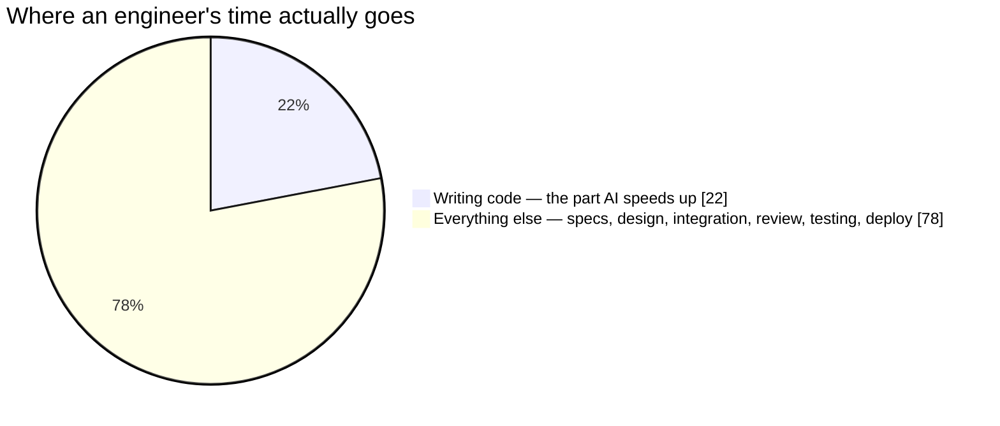
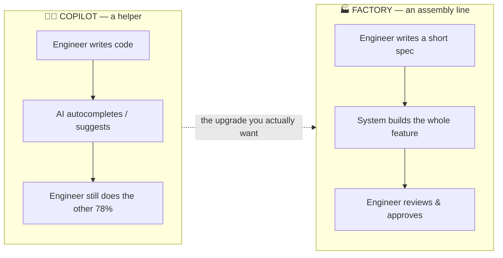
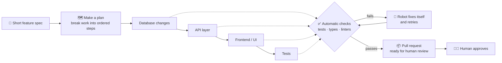
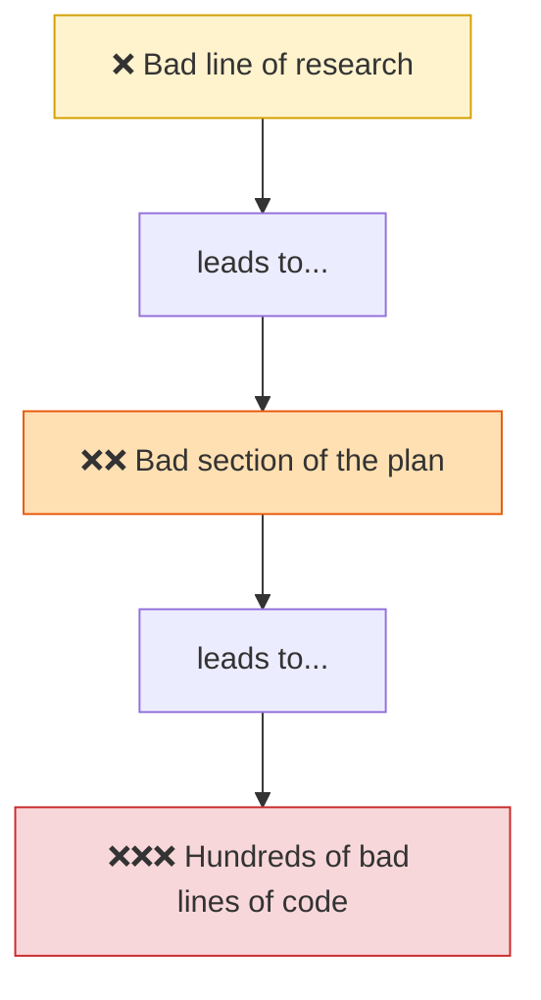
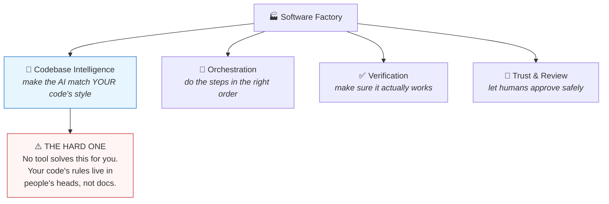
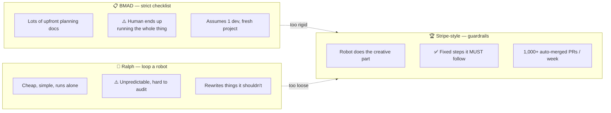
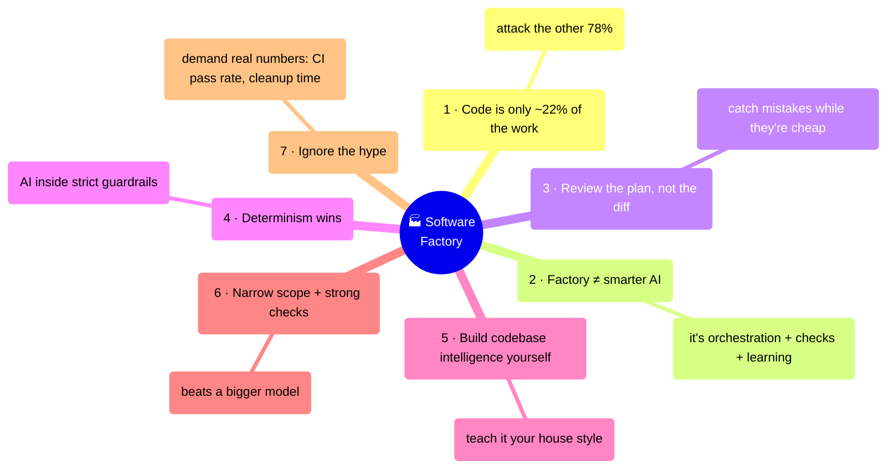

# Software Factory — The Simple Version (with Diagrams)

A plain-English companion to [software-factory-research.md](software-factory-research.md).
All diagrams are Mermaid — they render on GitHub, VS Code, and most markdown viewers.

---

## 1. The core surprise: code is the easy part

Everyone thinks AI makes teams fast because it writes code quickly. But writing
code was only ever a small slice of the job. AI speeds up that slice — and leaves
the rest untouched.

**In one line:** if AI makes 22% of the work twice as fast, the whole job barely
moves. That's why teams *feel* 30–40% faster but only ship ~11% faster.

---

## 2. Copilot vs. Factory: a helper vs. an assembly line

A **copilot** sits next to one engineer and helps them type faster.
A **factory** takes a feature request and runs it down an assembly line to a
finished, reviewed pull request — the human checks the work instead of doing it.

A factory isn't "a smarter AI." It's three extra things bolted around the AI:
a **coordinator** (decides the order of work), **automatic checks** (catch mistakes
before a human sees them), and a **learning loop** (gets better over time).

---

## 3. What the assembly line looks like

The spec goes in, and the work flows through stages that depend on each other.
After every stage there's an automatic **gate**: tests, type-checks, and linters.
If a gate fails, the robot fixes its own work and retries — *before* a human is
ever asked to look.

The trick that makes this reliable: **the checks live inside the loop, not just at
the end.** The robot can't move forward with broken work.

---

## 4. The biggest time-saver: review the plan, not the code

Humans are the slow, expensive part now (review time balloons with AI). The fix
isn't reviewing faster — it's reviewing *earlier and smaller*. Check the short plan,
not the giant pile of code, because mistakes get more expensive the later you catch them.

> A bad line of code is one bad line. A bad line of *plan* becomes hundreds of bad
> lines of code. So spend your scarce review attention up at the plan.

---

## 5. The four hard problems (and which is hardest)

Building a factory means solving four things. Three have decent off-the-shelf
tools. One you have to build yourself.

**Why codebase intelligence is the hard one:** every team has unwritten rules
("we always do payments *this* way"). A spec never captures them, so the AI writes
code that compiles but breaks your conventions. You have to teach the factory your
house style.

---

## 6. Which approach should you copy?

Three well-known styles. Two are popular but break in a real multi-team company.
One is the proven winner.

**The winning recipe (Stripe's):** let the AI be creative *inside* strict,
deterministic guardrails. More controllable than a free-running loop, less rigid
and bureaucratic than a checklist. This is the pattern to build toward.

---

## 7. The whole thing in seven sentences

1. **Code is the easy 22%** — the factory's real job is the other 78%.
2. **A factory is not a smarter AI** — it's a coordinator + automatic checks + a learning loop.
3. **Review the plan, not the code** — fix mistakes while they're still one sentence.
4. **Boring and predictable wins** — let AI be creative *inside* strict guardrails.
5. **Codebase intelligence is yours to build** — no tool teaches the AI your house style.
6. **Narrow the job, check it hard** — that beats waiting for a smarter model.
7. **Discount the hype** — "fully autonomous" demos are marketing; demand real metrics.
