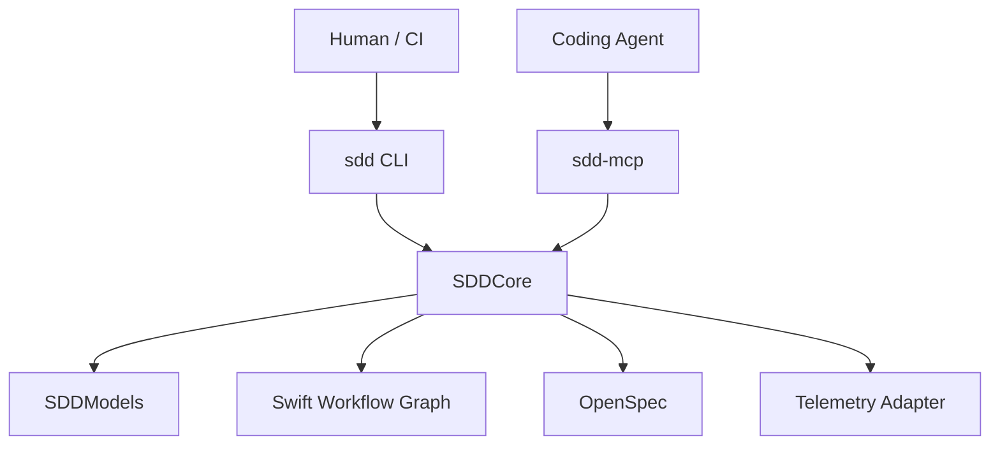
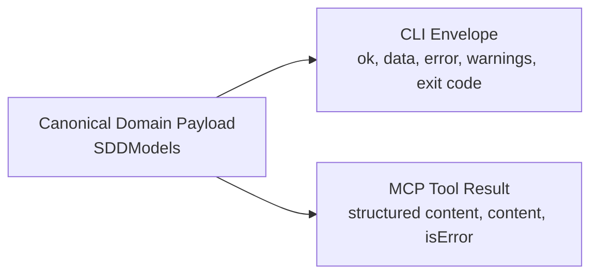
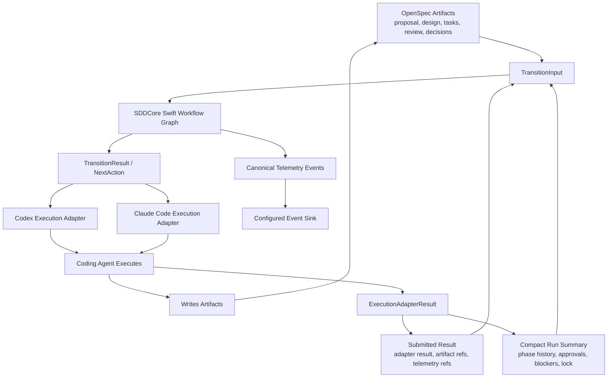
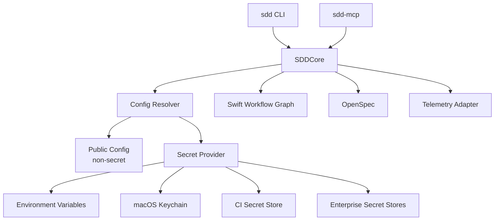
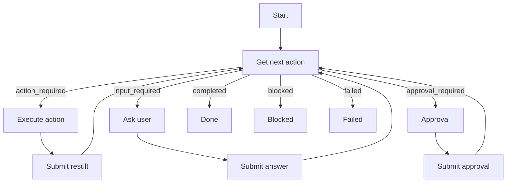

# Enterprise AI-SDD Requirements

## Purpose

This document records the current product and architecture decisions for evolving `ai-sdd` from a repo-local skills and commands framework into an enterprise-ready AI software delivery workflow system.

The intended product direction is to keep the existing Spec-Driven Development discipline while adding a typed interface, workflow orchestration, durable artifact storage, and telemetry.

## Context And Motivation

The current `ai-sdd` framework has proven useful at the individual engineer level. A senior engineer can use Codex, Claude Code, skills, commands, and repository-local markdown artifacts to guide AI agents through requirements refinement, planning, implementation, verification, and review. This creates a repeatable personal workflow that helps the engineer produce software faster while keeping AI work bounded by explicit artifacts and guardrails.

The next challenge is organizational adoption.

Engineering leaders regularly need to answer practical delivery questions before and during a project:

- How long will this project take?
- How many engineers are required?
- How much will the project cost?
- How much business value will it produce?
- How much AI usage and spend is associated with the work?
- What quality and architecture risks are being introduced?

Agentic AI changes the assumptions behind those questions. One engineer using modern AI workflows can produce output that previously required a small team. Project plans can become more granular because AI can help break down requirements, dependencies, and implementation tasks earlier. At the same time, the cost model becomes less visible because AI usage is often spread across chats, tools, providers, models, retries, and coding sessions.

As engineers delegate more implementation work to coding agents, the human role shifts from line-by-line coding toward orchestration, decision-making, architecture stewardship, and review. That shift increases the importance of explicit guardrails. Without a standard process, faster agentic coding can create inconsistent architecture, unclear ownership, weak verification, hidden costs, and artifacts that are difficult for other engineers or managers to audit.

This framework is being created to turn a successful personal AI-assisted workflow into an organizational software delivery methodology. The goal is to make AI-assisted engineering faster, more repeatable, more observable, and safer to scale across teams.

The framework should give:

- engineers a low-friction way to delegate work to agents without losing control of requirements, architecture, and verification
- staff and principal engineers a repeatable way to encode engineering judgment into reusable workflow contracts
- managers and directors visibility into delivery progress, review loops, verification outcomes, AI usage, and cost
- platform teams a standard golden path for AI-assisted development across repositories and tools
- executives a governance model for adopting agentic AI without relying on ad hoc prompts and undocumented local practices

The product motivation is not simply to make AI write code faster. The deeper motivation is to create a controlled delivery system where AI agents can accelerate work while humans retain clear authority over product decisions, architecture, cost, and quality.

## Problem Statement

Engineering teams adopting coding agents need a way to move faster without losing architectural control, verification discipline, traceability, and cost visibility.

The current `ai-sdd` framework works well for an individual engineer using Codex or Claude Code through skills and commands. The next iteration must make that workflow easier to standardize across an organization.

The system must address:

- platformized workflow execution to reduce cognitive load and deviations
- standardized methodology for repeatable agent-assisted delivery
- visibility into usage, cost, cycle time, quality, and review outcomes
- durable coordination across SDD phases
- guardrails that prevent agents from drifting outside approved requirements, architecture, and verification rules

## Product Scope

### In Scope

- A typed public workflow interface for coding agents and humans.
- A Swift implementation of the shared models and workflow tooling.
- A CLI interface for terminal users, CI, bootstrap, lazy invocation, and coding-agent execution.
- An MCP server interface for coding agents and agent-native integrations.
- Agent-agnostic execution adapters, with Codex and Claude Code supported as the initial coding-agent implementations.
- A native Swift workflow graph in `SDDCore` as the workflow runtime and state transition engine.
- OpenSpec as the artifact and specification store.
- Telemetry integration through a dedicated adapter layer.
- Support for durable step-by-step workflow execution.
- Support for multi-turn interaction when available through MCP clients.
- Configurable first-class interface modes for CLI, MCP, and auto-detection.

### Initial Scope Exclusions

- A hosted SaaS dashboard.
- Fully autonomous cross-repo execution.
- Direct dependency of the MCP server on shelling out to the CLI as the primary implementation path.
- Treating a continuous MCP conversation as the core workflow model.
- Making the Swift workflow graph or OpenSpec details part of the public agent-facing contract.
- Coupling the workflow contract to a single coding agent vendor, local agent runtime, or provider-specific prompt format.

## Core Architecture Decisions

### Decision 1: Use Swift For Tooling

The implementation language for the tooling will be Swift.

This is an explicit product and maintainer decision based on personal preference and expected maintainability for this project.

Swift packages will define the public models, core workflow behavior, CLI binary, and MCP server binary.

### Decision 2: CLI And MCP Are Sibling Interfaces

The CLI and MCP server must be sibling interfaces over the same core package.

The MCP server must not wrap the CLI as its primary implementation path. Shelling out to the CLI can exist only as an emergency compatibility fallback, not as the architectural design.

CLI and MCP are both first-class interface modes. Neither interface is the canonical interface for all users.

The active interface mode is selected by workspace or organization configuration.

Supported interface modes:

```text
cli
mcp
auto
```

Mode semantics:

- `cli` uses the `sdd` CLI as the workflow interface for humans, CI, and coding agents.
- `mcp` uses the `sdd-mcp` server as the workflow interface for coding agents and MCP-native clients.
- `auto` detects the configured MCP server and CLI availability, then selects one interface according to local policy.

MCP optimizes for agent-native typed tool calls. CLI optimizes for lazy invocation, lower fixed context cost, terminal usage, and CI compatibility.

The CLI implementation must use Swift Argument Parser.

The MCP server implementation must use `modelcontextprotocol/swift-sdk`.

`auto` mode is policy-driven and CLI-first by default. Interactivity is not an interface-selection criterion. CLI and MCP must both support `input_required` and `approval_required` workflow states with equivalent semantics.

Default `auto` priority:

```text
cli
mcp
```

`auto` selection may consider workspace policy, interface availability, client capability, CI/non-interactive context, and explicit local configuration. `auto` mode must not change workflow semantics.



### Decision 3: Public Contract Lives In A Thin Models Package

A dedicated `SDDModels` package will define the canonical public domain contract.

`SDDModels` must not depend on:

- CLI frameworks
- MCP protocol libraries
- OpenSpec clients
- telemetry frameworks

`SDDModels` owns:

- canonical model types
- JSON encoding and decoding shape for domain payloads
- schema versioning
- workflow phase names
- action kinds
- status names
- artifact references
- policy violation models

### Decision 4: Transport Envelopes Are Interface-Specific

The shared contract is the inner domain payload, not the outer transport response.

The CLI and MCP server can wrap the same domain model differently because each interface is governed by a different transport contract.



### Decision 5: SDDCore Owns The Native Swift Workflow Graph

`SDDCore` owns a native Swift typed workflow graph as the workflow runtime and state transition engine.

The Swift workflow graph owns:

- phase sequencing
- next-action derivation
- routing between phases
- retry and loop behavior
- human approval gates
- blocked states
- completion states

The workflow graph derives durable workflow context from OpenSpec artifacts and the compact OpenSpec run summary. OpenSpec is the durable artifact and audit source. The Swift workflow graph is the deterministic evaluator that reads those facts and returns the next typed action.

Coding agents must not encode phase transition rules independently. They must request the next action from the stable typed interface.

The workflow graph must be implemented in Swift inside `SDDCore`. LangGraph is not part of the MVP workflow runtime. The product may later add a LangGraph adapter only as an optional integration if a future use case requires LangGraph-native agent execution.

Workflow state boundary:



### Decision 6: Coding-Agent Execution Is Agent-Agnostic

The enterprise workflow must remain coding-agent agnostic.

`SDDCore` owns the workflow contract and returns typed actions. Coding-agent execution adapters translate those typed actions into the invocation mechanism required by a specific coding agent.

The initial supported coding-agent execution adapters are:

```text
codex
claude-code
```

The workflow contract must not assume Codex-specific or Claude-specific session behavior, command names, prompt syntax, tool names, logs, token metadata, or subagent mechanics. Those details belong only inside the corresponding execution adapter and telemetry attribution adapter.

Each coding-agent adapter must support the same logical responsibilities:

- receive a typed action from `SDDCore`
- render the action into that agent's supported invocation format
- preserve role isolation for planner, implementer, and reviewer work
- direct the agent to write required artifacts to the paths supplied by `SDDCore`
- return a structured result to `SDDCore`
- expose adapter-specific telemetry metadata without changing the public workflow contract

The product may add future adapters for other coding agents without changing `SDDModels`, OpenSpec artifact contracts, or the Swift workflow graph.

The Codex and Claude Code execution adapters must translate the existing SDD harness behavior into typed `ExecutionAdapter` implementations. Adapter-specific invocation mechanics remain inside those adapters.

### Decision 7: OpenSpec Owns Durable Artifacts

OpenSpec will be the durable artifact and specification store.

OpenSpec replaces `tasks_for_AI` as the durable artifact system for the enterprise workflow.

The enterprise workflow must not create new `tasks_for_AI/<feature_slug>/` artifacts. Existing `tasks_for_AI` artifacts remain part of the legacy repo-local workflow and may be migrated into OpenSpec by a separate migration path.

The workflow should map SDD concepts into OpenSpec artifacts, including:

- product intent
- feature changes
- closed decisions
- design and planning artifacts
- implementation tasks
- review artifacts
- architecture and verification constraints

The coding agent writes artifacts through the project workspace, but the artifact paths and required outputs are supplied by the workflow contract.

Canonical OpenSpec artifact ownership:

```text
Product intent                  -> OpenSpec proposal/change artifact
Feature slice                   -> OpenSpec change
Closed decisions                -> OpenSpec decision artifacts
Design and planning output      -> OpenSpec design artifact
Implementation checklist        -> OpenSpec task artifact
Review verdict and findings     -> OpenSpec review artifact
Architecture constraints        -> OpenSpec project/spec guidance artifact
Verification constraints        -> OpenSpec project/spec guidance artifact
```

The initial enterprise workflow will use `openspec/changes/<feature_slug>/` as the feature-scoped artifact root.

Initial artifact paths:

```text
openspec/changes/<feature_slug>/proposal.md
openspec/changes/<feature_slug>/design.md
openspec/changes/<feature_slug>/tasks.md
openspec/changes/<feature_slug>/review.md
openspec/changes/<feature_slug>/decisions.md
```

If OpenSpec requires different canonical paths in a target repository, `SDDCore` must resolve those paths through an OpenSpec adapter. Coding agents must use the paths returned by `get_next_action`, not hard-coded artifact paths.

The MVP must create the OpenSpec feature-scoped artifacts on `start_run`. A run must not require a pre-existing OpenSpec change.

The OpenSpec adapter spike validates adapter shape and mapping quality. It does not reopen the decision to use OpenSpec as the target enterprise artifact system.

The stack registry is project-provided and extensible. The product must not ship with a predefined universal stack catalog. The MVP supports one configured stack supplied by the adopting project.

### Decision 8: Telemetry Is Abstracted Behind The Core

Telemetry must be implemented behind an adapter boundary.

The public CLI and MCP interfaces should not expose details of the telemetry backend. `SDDCore` emits a canonical SDD event stream, and telemetry adapters route that stream to configured sinks without changing the coding-agent contract.

Telemetry is split into four explicit paths:

```text
Event router / CDP path   -> canonical SDD events for analytics and reporting destinations
OpenSpec audit path       -> compact run summary for local auditability and external telemetry correlation
Metrics path              -> aggregate counters, gauges, recorders, and timers through Swift Metrics
Tracing path              -> optional per-run timeline spans through OpenTelemetry-compatible tracing
```

The event router / CDP path is the primary reporting path. It must be provider-neutral. Twilio Segment is one compatible implementation, not the default or required provider. Free and open-source event routers such as RudderStack, Snowplow, Jitsu, and PostHog must be considered first for MVP evaluation. A custom webhook, Kafka, HTTP sink, or OpenTelemetry Collector export can also satisfy this adapter contract.

The product boundary is the CDP/event-router adapter interface. The product does not need to select or directly support every downstream analytics destination. Downstream routing, warehouse delivery, and BI integrations are owned by the configured CDP/event-router implementation.

OpenSpec is not the analytics store. OpenSpec must retain only a compact run summary attached to the change, including run ID, feature slug, phase transitions, approval decisions, blocker summaries, final verdict, telemetry event IDs or trace IDs, and token attribution summaries. Detailed reporting queries are served by the configured analytics destination, not by querying raw OpenSpec files.

Swift Metrics is the metrics API for aggregate operational measurements. It is not the durable reporting store.

OpenTelemetry-compatible tracing is optional for single-run timeline visibility. Tracing must not assume Codex or Claude Code internal LLM calls appear as native graph or provider spans. Coding-agent execution details are opaque by default and are attributed through adapter-specific metadata when available.

The MVP telemetry sink is a local JSONL event sink. The default local path is:

```text
.sdd/telemetry/events.jsonl
```

Telemetry must capture at least:

- run ID
- feature slug
- repository
- stack
- phase
- role
- interface used: `mcp` or `cli`
- event router destination metadata
- provider/model metadata when available
- token usage metadata when available
- token attribution confidence
- telemetry event IDs and trace IDs
- duration
- policy results
- verification results
- review verdict
- workflow status

### Decision 9: Secrets Are Resolved At Runtime Behind SDDCore

Secret configuration must be separated from the workflow contract and artifact model.

The system must follow these rules:

- `SDDModels` never contains raw secrets.
- OpenSpec never stores raw secrets.
- the Swift workflow graph never stores raw secrets.
- telemetry never emits raw secrets.
- CLI and MCP resolve secrets through `SDDCore` at execution time.



Repository-stored configuration may contain non-secret settings and secret references. It must not contain secret values.

Example public configuration:

```yaml
interface:
  mode: cli

openspec:
  workspace: ./openspec

telemetry:
  backend: otel
  service_name: ai-sdd
```

Example secret references:

```yaml
secrets:
  telemetry_api_key: keychain:ai-sdd/telemetry-api-key
  openspec_token: env:SDD_OPENSPEC_TOKEN
```

Secret values are resolved only when `SDDCore` needs to call an external service.

The secret provider boundary should support:

```text
Environment variables
macOS Keychain
CI secret injection
Enterprise secret stores
```

The MVP must support:

- environment variables
- macOS Keychain for local CLI and MCP usage
- CI environment variables

Enterprise integrations can later add:

- Vault
- 1Password
- AWS Secrets Manager
- Google Secret Manager
- Azure Key Vault
- SSO or OIDC token exchange

MCP must never ask the coding agent or user to paste a secret into chat. When a secret is missing, MCP must return a structured blocked response that names the missing secret reference but does not request or expose the value.

Example missing-secret response:

```json
{
  "status": "blocked",
  "reason": "missing_secret",
  "secret_ref": "SDD_OPENSPEC_TOKEN",
  "message": "OpenSpec token is not configured."
}
```

Telemetry must pass through a redaction layer before emission.

Telemetry redaction must cover:

- API keys
- bearer tokens
- connection strings
- signed URLs
- auth headers
- environment variable values
- model provider keys
- user-provided secret-like values

Telemetry may record the secret source and reference name, but never the secret value.

Example allowed telemetry metadata:

```json
{
  "secret_source": "env",
  "secret_name": "SDD_OPENSPEC_TOKEN"
}
```

The active interface mode must not change secret handling. CLI and MCP both use the same `SDDCore` secret resolution path.

## Package Structure

Recommended package layout:

```text
SDDModels
  Canonical domain models and schemas.

SDDCore
  Workflow operations, native Swift workflow graph, validation, OpenSpec adapter,
  telemetry adapter, and shared behavior.

SDDCLI
  CLI binary that imports SDDModels and SDDCore.

SDDMCP
  MCP server binary that imports SDDModels and SDDCore.
```

## Core Workflow Interface

The system should expose a small stable operation set.

Required operations:

```text
start_run
get_next_action
submit_result
answer_prompt
approve_gate
get_status
```

The CLI and MCP server must expose these operations with equivalent semantics.

The MVP operation model is intentionally small. The full-system operation model is tiered by responsibility.

Full-system lifecycle operations:

```text
start_run
get_next_action
submit_result
get_status
cancel_run
resume_run
```

Full-system input and approval operations:

```text
answer_prompt
approve_gate
reject_gate
```

Full-system artifact operations:

```text
list_artifacts
get_artifact
validate_artifacts
```

Full-system telemetry operations:

```text
get_run_summary
list_run_events
```

Full-system recovery operations:

```text
clear_lock
mark_blocked
retry_action
```

Full-system discovery operations:

```text
capabilities
validate_workspace
```

## V0 Core Contracts

The first implementation must use the following contracts as the v0 implementation baseline. Field names may be represented as Swift properties and JSON keys, but their meaning must remain stable.

### RunSummary

`RunSummary` is the compact durable run record attached to the OpenSpec change.

```json
{
  "run_id": "run_123",
  "feature_slug": "checkout-flow",
  "status": "action_required",
  "current_phase": "plan",
  "active_adapter": "codex",
  "lock": {
    "owner": "agent_session_123",
    "acquired_at": "2026-06-03T00:00:00Z",
    "expires_at": "2026-06-03T01:00:00Z"
  },
  "phase_history": [],
  "approvals": [],
  "blockers": [],
  "telemetry_refs": [],
  "token_usage_summary": []
}
```

### TransitionInput

`TransitionInput` is the complete input to the Swift workflow graph.

```json
{
  "run_summary": {},
  "artifact_refs": [],
  "latest_submitted_result": null,
  "workspace_context": {
    "repo": "org/repo",
    "stack": "web"
  }
}
```

The workflow graph must evaluate only `TransitionInput`. It must not read hidden process state to decide the next action.

### TransitionResult

`TransitionResult` is the graph output that becomes the public `NextAction` domain payload.

```json
{
  "run_id": "run_123",
  "status": "action_required",
  "phase": "plan",
  "agent_role": "web-developer",
  "action": {
    "kind": "produce_artifact",
    "required_inputs": [],
    "required_outputs": []
  },
  "blocked_reason": null,
  "failed_reason": null
}
```

### ExecutionAdapterResult

`ExecutionAdapterResult` is the result returned by a coding-agent execution adapter.

```json
{
  "adapter": "codex",
  "status": "ok",
  "artifact_refs": [],
  "log_ref": null,
  "telemetry_refs": [],
  "token_usage": null,
  "error": null
}
```

### TelemetryEvent

`TelemetryEvent` is the canonical event emitted by `SDDCore`.

```json
{
  "event_name": "sdd.transition",
  "run_id": "run_123",
  "feature_slug": "checkout-flow",
  "phase": "plan",
  "status": "action_required",
  "adapter": "codex",
  "timestamp": "2026-06-03T00:00:00Z",
  "properties": {}
}
```

### TokenAttribution

Token usage, not dollar cost, is the canonical usage metric.

```json
{
  "provider": "openai",
  "model": "gpt-5.5",
  "input_tokens": 117940,
  "output_tokens": 501,
  "cached_tokens": 31616,
  "reasoning_tokens": 275,
  "confidence": "session_scoped"
}
```

Token attribution confidence values:

```text
direct_request
session_scoped
time_window
unattributed
```

### Blocked And Failed Reasons

Blocked reasons:

```text
missing_input
missing_secret
missing_artifact
approval_required
lock_held
policy_violation
adapter_unavailable
unsupported_stack
```

Failed reasons:

```text
adapter_execution_failed
artifact_validation_failed
transition_evaluation_failed
telemetry_write_failed
openspec_write_failed
unexpected_error
```

### MVP Identity Attribution

The MVP identity model is attribution-only. Authentication and authorization remain outside the MVP.

Required attribution fields:

```text
actor_id
actor_type: human | agent | ci
agent_adapter: codex | claude-code | null
repo_id
workspace_id
machine_id
organization_id: nullable
```

### Full-System Identity And Authorization

The full-system identity model is external-identity-first hybrid.

The product must not own user authentication as its primary identity system. Future enterprise deployments must resolve actors through external identity providers and execution environments, including SSO/OIDC, GitHub identity, CI identity, machine identity, and coding-agent adapter identity.

`SDDCore` may maintain lightweight internal role and permission mappings for workflow authorization, but those mappings refer to external principals rather than locally owned user accounts.

MVP behavior is attribution-only. Full-system authorization must be able to control who can start runs, approve gates, submit results, clear locks, change configuration, and configure integrations.

The identity model must support these actor types:

```text
human
agent
ci
service
```

### MVP Concurrency

The MVP supports one active agent execution per feature slice.

Concurrency rules:

- one active run lock per `feature_slug`
- no concurrent multi-agent edits on the same slice
- a locked slice returns `blocked` with reason `lock_held`
- stale locks are cleared manually or by configured expiration policy

## Core Status Model

The workflow status model must include:

```text
action_required
input_required
approval_required
running
blocked
completed
failed
```

These statuses allow the agent to run a durable explicit loop without relying on one continuous conversation.

## Requirements Closure And Acceptance Requirements

The enterprise workflow must support generic intake normalization before per-slice SDD execution.

The full-system intake contract is format-based. The supported input format is Markdown with YAML front matter. The `intake_type` front-matter field selects the normalization strategy.

Required intake front matter:

```yaml
---
intake_type: prd
title: Checkout Flow
source_id: optional-external-id
owner: optional-owner
---
```

Built-in `intake_type` values can expand over time:

```text
partner_challenge
prd
rfc
customer_request
incident_report
architecture_migration
compliance_requirement
loose_idea
custom
```

Custom intake types are allowed through project-defined intake templates:

```yaml
---
intake_type: custom
custom_intake_template: sales_engineering_request
title: Enterprise SSO Request
---
```

MVP supported intake types are `partner_challenge` and `prd`. RFC input is the second intake type to support after the MVP.

The intake process must normalize source artifacts into the enterprise SDD planning model:

```text
product intent
feature catalog
dependency graph
stack assignment
closed decisions
execution status
slice-ready requirements
```

For repository-local legacy workflows, this maps to `MASTER_REQUIREMENTS.md`, `SDD_ORCHESTRATION.md`, `DECISIONS.md`, and `tasks_for_AI/<feature_slug>/requirements.md`. For the enterprise workflow, this maps to the equivalent OpenSpec-backed artifact model.

`close-requirement` behavior must remain optimized for closing executable slice requirements. When the solution space is materially open, requirements closure must capture considered alternatives, rejected options, and the reason for the selected direction. Narrow implementation slices do not require alternatives capture.

There is no mandatory standalone polish phase in the default SDD cycle.

The planning phase must classify whether a slice has an acceptance surface beyond technical correctness:

```text
none
ui_user_workflow
public_api
cli_workflow
operator_workflow
```

When the acceptance surface is `none`, standard implementation verification and review are sufficient.

When the acceptance surface is not `none`, the plan must include explicit acceptance criteria for that surface, and the review rubric must evaluate those criteria. UI slices use product and UX acceptance criteria. Public API slices use API ergonomics and contract usability criteria. CLI slices use command usability criteria. Operator workflow slices use runbook and operational ergonomics criteria.

The product must support a compound-learning experiment, but compound learning is not a default workflow requirement.

The compound-learning experiment compares SDD runs with and without a post-run learning capture step. The experiment must measure final quality, review iterations, total duration, token usage, repeated defect rate, usefulness of produced learning artifacts, and whether future runs consume those artifacts.

## Agent Interaction Model

The core interaction rule is:

> Ask the workflow for the next required action. Execute exactly that action. Submit the result back.

The coding agent should not infer the next phase from local files alone.

Human interaction is driven only by workflow transition state.

When the Swift workflow graph returns `input_required`, the coding agent must ask the user the required question and submit the answer through `answer_prompt`.

When the Swift workflow graph returns `approval_required`, the coding agent must ask the user for the required approval decision and submit the result through `approve_gate` or `reject_gate`.

These interactions are not MCP-specific. CLI and MCP must both represent `input_required` and `approval_required` with equivalent semantics. Interactions must be anchored to `run_id`, `phase`, `status`, a prompt or gate identifier, an expected answer shape, and the next allowed operation.



## MCP Multi-Turn Behavior

The design must support multi-turn MCP interaction, but it must not depend on a continuous MCP conversation as the core execution model.

MCP has a fixed context cost because tool names, descriptions, and schemas are loaded into the coding-agent session whether the tools are used or not. MCP mode should be enabled when agent-native tool calls, richer interaction, and structured MCP behavior justify that context cost.

The MCP server can use richer MCP behavior when supported by the client, including:

- asking follow-up questions
- requesting missing input
- reporting progress
- handling approval gates
- resuming a logical workflow run

The durable source of truth remains the workflow run state, not the open request.

Example logical interaction:

```text
Client: Give me the status of the project.
MCP: Which project do you want?
Client: Project A.
MCP: This project is ongoing. What data do you need?
Client: Expenditure for the current week.
MCP: Returns the report.
```

The same logical interaction must also be representable as explicit operation calls:

```text
get_next_action -> input_required
answer_prompt
get_next_action -> input_required
answer_prompt
get_next_action -> action_required
submit_result
```

## Interface Mode Selection

CLI and MCP are both first-class interfaces.

The active interface is selected by workspace or organization configuration, not by a universal preference for one interface over the other.

Supported modes:

```text
cli
mcp
auto
```

Mode selection rules:

- `cli` mode uses the CLI for humans, CI, bootstrap workflows, and coding-agent execution.
- `mcp` mode uses the MCP server for coding-agent execution and MCP-native interactions.
- `auto` mode allows the client or local configuration to select CLI or MCP based on availability and policy.

Auto-detection is a convenience mode. It must not change workflow semantics.

`auto` mode is a full-system convenience mode. It detects configured MCP and CLI availability, applies local policy, and selects one interface. The MVP does not implement `auto`; it supports `cli` only.

Both CLI and MCP must use the same `SDDModels` domain contract and the same `SDDCore` implementation.

The CLI must support structured JSON output for agent use.

Example commands:

```bash
sdd capabilities --json
sdd start --feature checkout-flow --json
sdd next --run-id run_123 --json
sdd submit-result --run-id run_123 --phase plan --json < result.json
sdd status --run-id run_123 --json
```

The CLI must expose a discovery command:

```bash
sdd capabilities --json
```

The capabilities response must include:

- schema version
- core version
- supported commands
- supported operation names
- supported output modes
- compatibility information

The MCP server must expose a compact tool surface to control session context cost.

MCP tool descriptions and schemas must stay focused on the typed workflow operations. They must not inline the full SDD methodology, OpenSpec documentation, architecture rules, or long prompt bodies. Detailed workflow instructions are returned at runtime through `get_next_action`.

## Versioning Requirements

Every public response must include enough version metadata to detect incompatibility.

Required version fields:

```text
schema_version
protocol_version
core_version
```

The CLI and MCP server must fail fast when the local core version is incompatible with the workflow backend or model schema.

## Security And Safety Requirements

The system must enforce:

- workspace root validation
- no implicit destructive operations
- explicit confirmation for destructive actions
- structured JSON input for complex CLI commands
- no shell command composition by coding agents
- clear telemetry labeling of the active interface: `cli` or `mcp`
- policy checks before workflow advancement

## Example Domain Payload

This is an example of a canonical `NextAction` domain payload. The CLI and MCP server may wrap it differently.

```json
{
  "schema_version": "1.0.0",
  "run_id": "run_123",
  "feature_slug": "checkout-flow",
  "phase": "plan",
  "status": "action_required",
  "agent_role": "web-developer",
  "action": {
    "kind": "produce_artifact",
    "instruction": "Produce a decision-closed implementation plan for the OpenSpec change.",
    "required_inputs": [
      {
        "type": "openspec_change",
        "path": "openspec/changes/checkout-flow/proposal.md"
      },
      {
        "type": "architecture_doc",
        "path": "legacy/docs/architecture-doc.md"
      }
    ],
    "required_outputs": [
      {
        "type": "design",
        "path": "openspec/changes/checkout-flow/design.md"
      },
      {
        "type": "tasks",
        "path": "openspec/changes/checkout-flow/tasks.md"
      }
    ]
  },
  "completion_contract": {
    "submit_phase": "plan",
    "requires_human_approval": true
  }
}
```

## MVP Requirements

The full system requirements describe the intended enterprise framework. The MVP narrows those requirements to the smallest implementation that proves the product direction before building a dashboard or broad integration matrix.

MVP capabilities:

1. Define `SDDModels`.
2. Implement `SDDCore` operations for a single-feature SDD workflow.
3. Implement CLI commands with JSON output as the first runnable interface.
4. Define the MCP domain contract shape, but defer MCP server implementation.
5. Implement the native Swift workflow graph in `SDDCore` for phase sequencing, next-action derivation, routing, approval gates, blocked states, completion states, and retry loops.
6. Implement coding-agent execution adapters for Codex and Claude Code with equivalent workflow semantics.
7. Derive workflow context from OpenSpec artifacts and the compact OpenSpec run summary.
8. Run an OpenSpec artifact adapter spike that maps the existing SDD artifact model to OpenSpec paths.
9. Resolve feature-scoped artifacts under `openspec/changes/<feature_slug>/` through the OpenSpec adapter.
10. Support Markdown plus YAML-front-matter intake normalization for `partner_challenge` and `prd` intake types.
11. Support planning-time acceptance-surface classification.
12. Support alternatives capture only when the planner marks the solution space as materially open.
13. Persist a compact OpenSpec run summary for local auditability and telemetry correlation.
14. Emit canonical SDD telemetry events to the local JSONL event sink through the telemetry adapter.
15. Capture basic token usage attribution with confidence levels for Codex and Claude Code.
16. Define Swift Metrics and OpenTelemetry adapter contracts, but defer broad backend support.
17. Support durable explicit loops through `get_next_action` and `submit_result`.
18. Support `input_required` and `approval_required` states.
19. Provide `capabilities` and version compatibility checks.
20. Support configured interface mode `cli`; keep `mcp` and `auto` as full-system requirements outside the MVP implementation.

MVP deferred capabilities:

- MCP server implementation.
- Broad event-router / CDP destination matrix.
- Swift Metrics backend integration beyond the adapter contract.
- OpenTelemetry tracing backend integration beyond the adapter contract.
- Hosted dashboard.
- Full OpenSpec migration of all legacy `tasks_for_AI` workflows.
- Additional coding-agent adapters beyond Codex and Claude Code.
- Mandatory compound-learning step.
- Full generic intake coverage for every supported artifact type.

## Open Questions

No open decisions remain for the current requirements document.

## Current Recommendation

Build the product around a stable `SDDModels` contract and a shared `SDDCore` implementation. Expose that behavior through sibling CLI and MCP interfaces. Let the native Swift workflow graph in `SDDCore` own workflow transition semantics, OpenSpec own durable artifacts and compact run summaries, and telemetry remain behind adapter-based sinks.

The agent-facing mental model should remain simple:

```text
Ask for the next action.
Execute the returned action contract.
Submit the result.
Repeat until completed, blocked, or failed.
```
